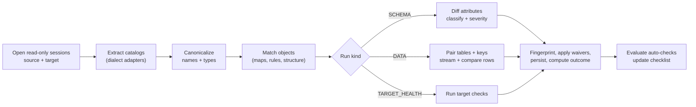
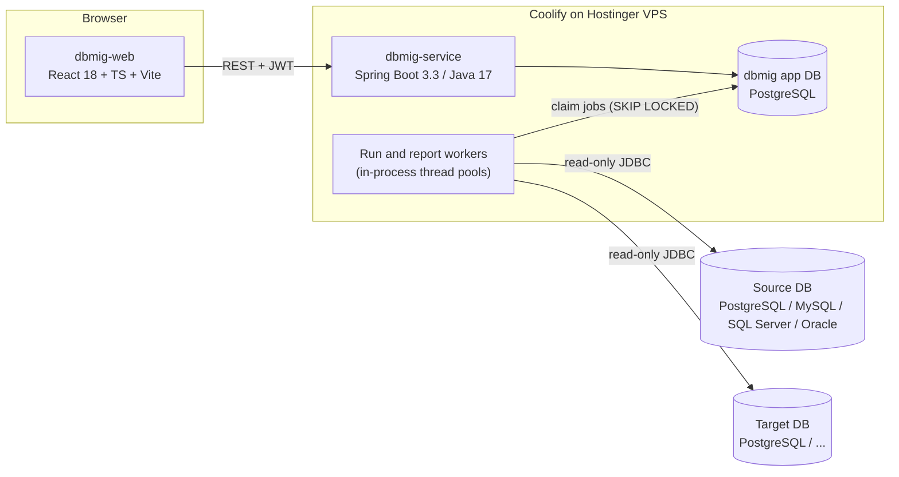
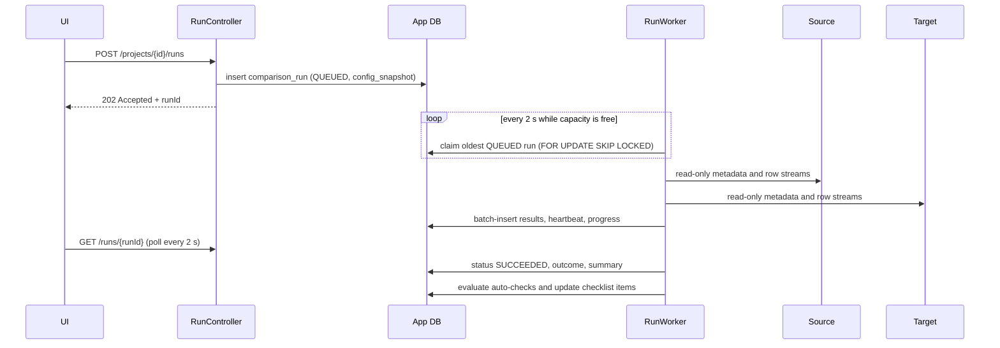
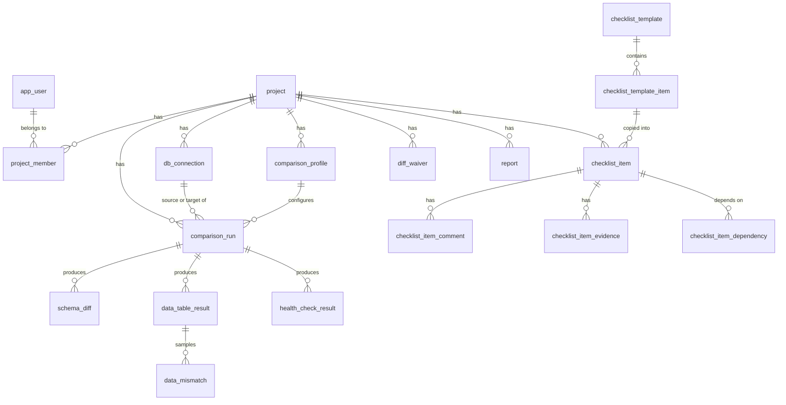

# DB Migration Assistant: Web Application Specification

| | |
|---|---|
| **Working name** | `dbmig` (DB Migration Assistant) |
| **Status** | Draft v0.1, for review |
| **Date** | 2026-09-24 |
| **Stack** | Java 17 · Spring Boot 3.3.x · PostgreSQL (app DB) · React 18 · TypeScript · Vite |
| **Proposed repos** | `dbmig-service` (backend) and `dbmig-web` (frontend) |
| **Hosting** | Hostinger VPS · Coolify · Nixpacks (same as Cooked) |

> This document is kept in `cooked-service` only as a design spec. dbmig is a **separate
> application**. It reuses the house conventions from this repo's `CLAUDE.md`: the package
> layout, stateless JWT security, PostgreSQL enum handling, `db/setup.sql` as the canonical
> schema, and inline-style React built on the `src/components/ui/` primitives. It is built,
> tested and deployed the same way.

## Contents

1. [Overview](#1-overview)
2. [Goals and non-goals](#2-goals-and-non-goals)
3. [Users, roles and permissions](#3-users-roles-and-permissions)
4. [Core concepts](#4-core-concepts)
5. [Functional requirements](#5-functional-requirements)
6. [Default migration checklist](#6-default-migration-checklist)
7. [Comparison engine](#7-comparison-engine)
8. [Reports](#8-reports)
9. [Architecture](#9-architecture)
10. [Data model](#10-data-model)
11. [REST API](#11-rest-api)
12. [UI specification](#12-ui-specification)
13. [Non-functional requirements](#13-non-functional-requirements)
14. [Security](#14-security)
15. [Testing strategy](#15-testing-strategy)
16. [Deployment and configuration](#16-deployment-and-configuration)
17. [Delivery plan](#17-delivery-plan)
18. [Risks and mitigations](#18-risks-and-mitigations)
19. [Open questions](#19-open-questions)
- [Appendix A: Proposed `db/setup.sql`](#appendix-a-proposed-dbsetupsql)
- [Appendix B: Profile config and payload examples](#appendix-b-profile-config-and-payload-examples)
- [Appendix C: Dependencies](#appendix-c-dependencies)

---

## 1. Overview

### 1.1 Problem

Database migrations (version upgrades, re-platforming such as Oracle/MySQL/SQL Server to
PostgreSQL, cloud moves, consolidations) tend to fail in the same few ways:

- a step gets skipped
- sequences are not reset
- a column is silently truncated
- an index goes missing
- rows are lost in a failed batch
- on cutover night nobody can prove the target matches the source

Teams usually track all of this in spreadsheets, ad-hoc SQL scripts and chat threads.

### 1.2 Solution

A web application that gives a migration team one place to:

1. **Run the migration from a checklist.** Standard migration activities are grouped by phase,
   each with owners, due dates, evidence, dependencies, gates and sign-offs. Items that a
   comparison can prove are marked done by the system.
2. **Compare source and target.** Schema (DDL) comparison works across database dialects. Data
   comparison ranges from row counts up to full row-by-row diffing. Differences the team accepts
   can be waived.
3. **Prove it with reports.** Reports are immutable, downloadable snapshots (PDF, Excel, CSV,
   JSON, HTML) covering checklist status, schema differences, data validation, go/no-go
   readiness and final sign-off.

### 1.3 Guiding principles

- **Read-only against the migrated databases.** dbmig never writes to a source or target
  database. It generates fix scripts, and people decide whether to run them.
- **Evidence over assertion.** If a comparison can verify a checklist item, the comparison sets
  it, and the latest result always wins.
- **Bounded resources.** Every comparison streams its data, so memory does not grow with table
  size. Load on production databases is capped and visible.
- **Explainable results.** Every difference records what was compared, how values were
  normalized, and why it received its severity.

### 1.4 Assumptions

- The target is usually PostgreSQL and sources vary. Fix-script generation targets PostgreSQL
  first.
- One organization (Human Workstream and its client projects) with access control per project.
  It is not multi-tenant SaaS in v1.
- The dbmig backend can reach the source and target databases over the network (see §16.3).
- Projects have 2 to 20 people, and there are tens of projects, not thousands.

---

## 2. Goals and non-goals

### Goals

| # | Goal |
|---|---|
| G1 | Standardize migration work with a reusable, editable checklist template covering every phase from discovery to post-migration. |
| G2 | Detect every structural difference between source and target that could lose data or break applications. |
| G3 | Detect data differences with the level of rigor each table needs: count, profile or full compare. |
| G4 | Produce audit-ready reports and a clear go/no-go verdict for cutover. |
| G5 | Keep the load on production databases low and predictable. |

### Non-goals

- **Performing the migration.** dbmig does no ETL, bulk loading, CDC or replication. Teams keep
  using pg_dump/pg_restore, pgloader, ora2pg, AWS DMS, Debezium and similar tools.
- **Running DDL or DML on source or target**, including the fix scripts dbmig generates.
- **Being a SQL IDE** or general query console.
- **Translating stored procedures between dialects.** Routines are compared, not converted.
- **Multi-tenant billing.** This could be added later through subscription-service (see §19).

---

## 3. Users, roles and permissions

### 3.1 Personas

| Persona | What they need |
|---|---|
| Migration lead / DBA lead | Plans phases, assigns work, owns the go/no-go decision, signs off gates, accepts waivers |
| Migration engineer / DBA | Registers connections, runs comparisons, investigates differences, updates checklist items |
| Application owner / QA | Tracks validation and testing items, adds evidence and comments |
| Stakeholder / auditor | Reads dashboards and downloads reports without changing anything |
| Administrator | Manages users and checklist templates |

### 3.2 Roles

- **Global role** (`app_user.role`): `ADMIN` or `USER`.
- **Project role** (`project_member.role`): `LEAD`, `ENGINEER` or `VIEWER`.
- `ADMIN` has LEAD rights on every project.
- Any `USER` can create a project and becomes its LEAD.

### 3.3 Permission matrix

| Action | ADMIN | LEAD | ENGINEER | VIEWER |
|---|:-:|:-:|:-:|:-:|
| Manage users and checklist templates | ✔ | | | |
| Edit project settings and members | ✔ | ✔ | | |
| Create, edit and delete connections | ✔ | ✔ | | |
| Test a saved connection, browse its schemas | ✔ | ✔ | ✔ | |
| Create and edit comparison profiles | ✔ | ✔ | ✔ | |
| Launch and cancel runs, download fix scripts | ✔ | ✔ | ✔ | |
| Update checklist items (status, owner, due date, evidence) | ✔ | ✔ | ✔ | |
| Comment on checklist items | ✔ | ✔ | ✔ | ✔ |
| Add or delete checklist items, edit gate/auto-check flags | ✔ | ✔ | | |
| Sign off gate items, override auto-checks | ✔ | ✔ | | |
| Create and revoke waivers | ✔ | ✔ | | |
| Generate reports | ✔ | ✔ | ✔ | |
| View results, download reports | ✔ | ✔ | ✔ | ✔ |
| View audit log | ✔ | ✔ | | |
| Delete a report or a project | ✔ | | | |

Authorization is enforced in the service layer (`ProjectAccessService.require(projectId, role)`),
resolving membership from `SecurityUtils.getCurrentUserId()`. For paths keyed by a child entity
(`/runs/{runId}`), the service loads the entity's project first and then checks access. A user
who is not a member gets **404, not 403**, so the API does not reveal which projects exist.

---

## 4. Core concepts

| Term | Meaning |
|---|---|
| **Project** | One migration effort, for example "ERP Oracle 19c → PostgreSQL 16". It owns connections, checklist, profiles, runs, waivers and reports. |
| **Connection** | Endpoint and credentials for one database. It has a side (`SOURCE`/`TARGET`) and an environment label such as PROD, UAT or REHEARSAL. |
| **Checklist template** | An admin-maintained list of standard activities. It is copied into a project when the project is created. |
| **Checklist item** | A project's own copy of an activity, with status, owner, due date, evidence, comments and dependencies. |
| **Phase** | One of eight ordered stages: Discovery, Planning, Preparation, Schema, Data, Validation, Cutover, Post-migration. |
| **Gate** | An item that must be `DONE` and signed off by a LEAD before its phase counts as complete. |
| **Auto-check** | An item bound to a check (for example `ROW_COUNTS_MATCH`). The system sets its status from the latest relevant run. |
| **Comparison profile** | Saved comparison settings: scope, name mappings, type mappings, ignore rules, severity overrides and data options. |
| **Run** | One asynchronous execution of a `SCHEMA`, `DATA` or `TARGET_HEALTH` comparison. A run has a *status* (did it execute?) and an *outcome* (`PASS` / `WARN` / `FAIL`). |
| **Diff** | One schema difference found by a run. |
| **Fingerprint** | A stable hash that identifies "the same difference" across runs. Waivers carry forward by fingerprint. |
| **Waiver** | An accepted difference, with reason, author, optional expiry and, for data, an optional mismatch tolerance. |
| **Report** | An immutable snapshot of generated output, stored with its SHA-256. |

---

## 5. Functional requirements

Priority tags: **MVP** is the first release. **P2** is phase 2.

### 5.1 Authentication and users

| ID | Pri | Requirement |
|---|---|---|
| FR-AUTH-1 | MVP | Email and password login issues a JWT (jjwt 0.12.6, HS256, configurable TTL). Passwords are stored as BCrypt hashes. |
| FR-AUTH-2 | MVP | ADMIN creates users with a temporary password. The user must change it at first login, the same flow as Cooked. |
| FR-AUTH-3 | MVP | ADMIN can deactivate users. `JwtAuthenticationFilter` rejects inactive users; the user lookup is cached for 60 s. |
| FR-AUTH-4 | MVP | Login throttling: 5 failed attempts per email and IP in 15 minutes returns 429 (reuse Cooked's `AuthRateLimitFilter`). |
| FR-AUTH-5 | P2 | Google SSO, reusing Cooked's `GoogleTokenVerifier` approach. |

### 5.2 Projects

| ID | Pri | Requirement |
|---|---|---|
| FR-PRJ-1 | MVP | Create a project with name, description, strategy (`BIG_BANG`, `PHASED`, `TRICKLE_CDC`, `PARALLEL_RUN`), planned cutover time and checklist template (the default template is preselected). The creator becomes LEAD. Template items are **copied**, so later template edits never change existing projects. |
| FR-PRJ-2 | MVP | Manage members and their project roles. The last LEAD cannot be removed (409). |
| FR-PRJ-3 | MVP | Project list shows status, cutover date, checklist completion % and the latest go/no-go verdict. |
| FR-PRJ-4 | MVP | Archiving makes a project read-only. Hard delete is ADMIN-only and cascades. |
| FR-PRJ-5 | P2 | Clone a project for a repeat migration: connections (without passwords), profiles and custom checklist items. |

### 5.3 Connections

| ID | Pri | Requirement |
|---|---|---|
| FR-CON-1 | MVP | Register a connection with structured fields only: name, side, environment, dialect, host, port, database or service name, username, password, SSL mode, optional CA certificate (PEM), schemas in scope, and allow-listed driver properties. **Raw JDBC URLs are never accepted** (see §14.2). |
| FR-CON-2 | MVP | Test a connection, saved or unsaved. The test connects read-only and records server version, encoding, collation, time zone and latency. It **warns if the account has write privileges**. |
| FR-CON-3 | MVP | The password is write-only. It is never returned by the API, and edits keep the stored password unless a new one is sent. |
| FR-CON-4 | MVP | Browse schemas and tables of a connection, used by the pickers in profiles and runs. |
| FR-CON-5 | MVP | One default connection per side per project, used by auto-checks and the dashboard. |
| FR-CON-6 | MVP | Supported dialects: PostgreSQL 12+, MySQL 8.0+, MariaDB 10.6+. |
| FR-CON-7 | P2 | Add SQL Server 2017+ and Oracle 19c+. |
| FR-CON-8 | P2 | SSH tunnel through a bastion host, and credentials held in an external secret store. |

### 5.4 Checklist

| ID | Pri | Requirement |
|---|---|---|
| FR-CHK-1 | MVP | The project checklist is grouped into the 8 phases, with progress per phase and overall. |
| FR-CHK-2 | MVP | Item fields: code, title, description, guidance, phase, status, status note, priority (`LOW`, `MEDIUM`, `HIGH`, `CRITICAL`), assignee, due date, gate flag, evidence-required flag, auto-check binding, completed by/at, signed off by/at. |
| FR-CHK-3 | MVP | Statuses: `NOT_STARTED`, `IN_PROGRESS`, `BLOCKED`, `DONE`, `NOT_APPLICABLE`. |
| FR-CHK-4 | MVP | Filters: phase, status, assignee, gates only, overdue, auto-check items. |
| FR-CHK-5 | MVP | Add custom items and edit any item. Only custom items can be deleted. Template-derived items can be set `NOT_APPLICABLE` instead, which keeps reports comparable across projects. |
| FR-CHK-6 | MVP | Plain-text comments on each item. |
| FR-CHK-7 | MVP | Evidence on each item: a link, an uploaded file (≤ 20 MB), a comparison run, or a generated report. |
| FR-CHK-8 | MVP | Dependencies between items. Cycles are rejected with 400. |
| FR-CHK-9 | MVP | Gate items require LEAD sign-off after they are `DONE`. |
| FR-CHK-10 | MVP | Auto-check items are driven by run results (rules below). |
| FR-CHK-11 | MVP | Template administration: CRUD, clone, set default. Template items carry phase, code, guidance, gate flag, evidence-required flag, auto-check type, auto-check config and default priority. |
| FR-CHK-12 | P2 | CSV import and export of checklists, @mentions, due-date reminders. |

**Checklist business rules**

| ID | Rule |
|---|---|
| BR-1 | `BLOCKED` and `NOT_APPLICABLE` require a status note. This is enforced by a DB `CHECK` and by request validation. |
| BR-2 | Only a LEAD can set a gate item to `NOT_APPLICABLE`. |
| BR-3 | An item cannot become `DONE` while any dependency is not `DONE` or `NOT_APPLICABLE` (409 `DEPENDENCY_NOT_DONE`). |
| BR-4 | An item with `evidence_required` needs at least one evidence entry before `DONE` (409 `EVIDENCE_REQUIRED`). |
| BR-5 | A phase is complete when every item in it is `DONE` or `NOT_APPLICABLE` and every gate item is `DONE` and signed off. |
| BR-6 | **Auto-checks follow the latest evidence.** When a relevant run finishes, `AutoCheckService` evaluates the bound items. On PASS the item becomes `DONE` (completed by *system*), `auto_verified_run_id` is set and the run is attached as evidence. On FAIL the item becomes `BLOCKED` with a system note (for example "Run 1041: 3 schema errors"), **and any sign-off is cleared**. A regression after sign-off must be visible before cutover. |
| BR-7 | A *relevant run* matches the item's `auto_check_config`: connection pair (default: the project's default source and target), optional profile, minimum data method, and `maxAgeHours`. Cutover items default to `maxAgeHours: 6`, so a run from last week cannot pass final validation. |
| BR-8 | A LEAD can override an auto-check with a reason. The override is audited and holds until the next relevant run finishes. |
| BR-9 | When the project setting `enforce_phase_gates` is on, items in phase *N* cannot move to `IN_PROGRESS` or `DONE` until every gate in phase *N−1* is signed off. It is off by default; the UI shows a warning instead. |
| BR-10 | Every change to an item writes an `audit_log` row with before and after values. |

### 5.5 Schema (DDL) comparison

| ID | Pri | Requirement |
|---|---|---|
| FR-SCH-1 | MVP | Launch a schema run with a source connection, a target connection and a profile (saved or ad hoc). The run is asynchronous, with progress and cancel. |
| FR-SCH-2 | MVP | Object types compared: schema, table, column, primary key, foreign key, unique constraint, check constraint, index, view, sequence/identity, function, procedure, trigger. |
| FR-SCH-3 | P2 | Additional object types: materialized views, user-defined and enum types, partitions, grants, comments. |
| FR-SCH-4 | MVP | Name matching is case-insensitive by default. Profiles can add schema, table and column rename maps and include/exclude glob patterns. |
| FR-SCH-5 | MVP | Constraints and indexes are **matched by structure** (table, columns, kind), not by name. A name difference alone is `INFO`. System-generated names such as Oracle `SYS_C00123` or MySQL `fk_1` never cause false alarms. |
| FR-SCH-6 | MVP | Column types are compared through canonical types plus mapping rules (§7.5). |
| FR-SCH-7 | MVP | Each difference is classified as `MISSING_IN_TARGET`, `EXTRA_IN_TARGET` or `CHANGED`, with severity `ERROR`, `WARNING` or `INFO` (§7.6). Profiles can override severities. |
| FR-SCH-8 | MVP | Diff viewer: object tree with counts, filters, attribute-level diff table, and side-by-side DDL with changed lines highlighted. |
| FR-SCH-9 | MVP | Waive a difference with a reason and optional expiry. The waiver applies to the same fingerprint in later runs. |
| FR-SCH-10 | MVP | Download a suggested fix script for a PostgreSQL target (§7.8). |
| FR-SCH-11 | MVP | Object inventory in every run summary: counts per object type for each side (supports checklist item DISC-03). |
| FR-SCH-12 | P2 | Run-to-run comparison ("what changed since the last run") and fix scripts for MySQL, SQL Server and Oracle targets. |

### 5.6 Data comparison

| ID | Pri | Requirement |
|---|---|---|
| FR-DAT-1 | MVP | Launch a data run with method `ROW_COUNT`, `PROFILE` or `FULL` (§7.9). Tables are either all matched tables or an explicit list, with per-table overrides. |
| FR-DAT-2 | MVP | Tables are paired using the profile's name mapping. A table found on only one side is reported as `SKIPPED` with the reason. |
| FR-DAT-3 | MVP | Key detection order: primary key, then a unique index on NOT NULL columns, then user-specified key columns. Without a key, `FULL` is skipped and the table falls back to `ROW_COUNT` + `PROFILE`. |
| FR-DAT-4 | MVP | Columns are paired by mapped name, excluded columns are dropped, and values are normalized according to their type (§7.11). |
| FR-DAT-5 | MVP | Structured row filters (column, operator, value) use bind parameters. The same predicate is applied to both sides using mapped column names. |
| FR-DAT-6 | MVP | Per-table results: row counts per side, matched, missing, extra, value diffs, duplicate keys, status and duration. Mismatch samples are stored up to a cap (default 100 per table) and masked (§14.4). |
| FR-DAT-7 | MVP | Mismatch drill-down grid with differing columns highlighted, CSV export, and a **lookup SQL** button that generates the `SELECT` statements to fetch the mismatched keys from each side. |
| FR-DAT-8 | MVP | Safety controls: read-only sessions, statement timeout, parallelism cap, fetch size, and an optional rows-per-second throttle (§7.15). |
| FR-DAT-9 | MVP | Table-level waivers with an optional tolerance ("accept up to 200 mismatches"). |
| FR-DAT-10 | P2 | `SAMPLE` method, in-database hash pushdown for same-dialect pairs, hash-partition fallback, multiset compare for keyless tables, mismatch recheck, resumable runs, scheduled runs with trend charts. |

### 5.7 Target health checks

| ID | Pri | Requirement |
|---|---|---|
| FR-HLT-1 | MVP | For a PostgreSQL target, a `TARGET_HEALTH` run checks: sequences aligned, foreign key integrity, indexes valid, statistics fresh, triggers enabled (§7.14). |
| FR-HLT-2 | P2 | The same checks for MySQL, SQL Server and Oracle targets. |

### 5.8 Reports

| ID | Pri | Requirement |
|---|---|---|
| FR-RPT-1 | MVP | Generate the report types in §8 in the formats listed in the §8 matrix. |
| FR-RPT-2 | MVP | Generation is asynchronous. Each report is stored as an immutable snapshot with its SHA-256, and can be listed, previewed and downloaded. |
| FR-RPT-3 | MVP | Every report carries a header with project, generated by/at, source and target labels with server versions, run IDs and a config summary. The footer shows the report ID and page *n*/*N*. The app shows the file's SHA-256 so anyone can verify a copy. |
| FR-RPT-4 | MVP | One click attaches a report as evidence to a checklist item, such as SCH-10 or CUT-01. |
| FR-RPT-5 | P2 | Scheduled reports by email, and custom branding (logo, company name). |

### 5.9 Dashboard and readiness

| ID | Pri | Requirement |
|---|---|---|
| FR-DSH-1 | MVP | Project overview: go/no-go panel, progress per phase, recent runs, blocked and overdue items, items due soon, countdown to cutover. |
| FR-DSH-2 | MVP | The **go/no-go verdict** is `GO` only when every criterion below passes. Otherwise it is `NO-GO` with the failing criteria listed. Readiness is deliberately **not** a blended percentage, because a score like "92% ready" can hide one fatal gap. |
| FR-DSH-3 | P2 | Trend charts: mismatches per run over time, checklist burn-up. Per-project go/no-go criteria. |

Go/no-go criteria:

1. Every gate item in phases Discovery through Validation is `DONE` and signed off.
2. No item in phases Discovery through Validation is `BLOCKED`.
3. The latest schema run on the default connections (no older than 7 days) has no unwaived `ERROR`.
4. The latest data run on the default connections has every in-scope table `MATCH` or waived.
5. The latest target health run passes, or its failures are waived.
6. Both default connections tested OK within the last 24 hours.

### 5.10 Audit log

| ID | Pri | Requirement |
|---|---|---|
| FR-AUD-1 | MVP | An append-only audit log records every mutation, run event, report event, waiver, sign-off and override. It is viewable per project by LEAD and ADMIN and can be exported as CSV. |

### 5.11 Notifications (P2)

Email and optional Slack webhook for: run finished or failed, item assigned to me, gate regressed
after sign-off (BR-6), waiver expiring, cutover in 24 hours.

---

## 6. Default migration checklist

The seeded template **"Standard database migration"** contains the items below. Admins can clone
it into specialized templates, for example "Oracle → PostgreSQL", "MySQL major upgrade" or
"Cloud lift-and-shift". Codes are stable so reports stay comparable across projects.

Legend: **⛩** = gate item. **Auto** = auto-check type (§7.14 and BR-6). **Evidence** = what the
item's evidence should normally be.

### Phase 1: Discovery and assessment (`DISCOVERY`)

| Code | Activity | ⛩ | Auto | Evidence |
|---|---|:-:|---|---|
| DISC-01 | Define migration scope: databases, schemas and objects in scope and out of scope | ⛩ | | Scope document |
| DISC-02 | Record source and target platform facts: version, edition, character set, collation, time zone, case sensitivity | | | Connection test output |
| DISC-03 | Inventory source objects: tables, views, sequences, routines, triggers, synonyms, jobs, DB links, user types | | | Schema run inventory |
| DISC-04 | Measure data volumes: row counts, table and LOB sizes, growth rate | | | Row-count run / sizing sheet |
| DISC-05 | Identify dependent applications, ETL jobs, reports, integrations and their connection strings | | | Dependency list |
| DISC-06 | Identify incompatible features: vendor-specific types, proprietary SQL, packages, hierarchical queries, autonomous transactions | | | Assessment notes |
| DISC-07 | Profile source data quality: orphans, invalid dates, encoding problems, duplicates, values exceeding target type limits | | | Profiling results |
| DISC-08 | Classify sensitive data (PII, PHI, PCI) and compliance needs: retention, residency, encryption | | | Classification register |
| DISC-09 | Capture a performance baseline: top queries, response times, batch durations | | | Baseline metrics |
| DISC-10 | Agree business constraints: downtime window, RTO, RPO | ⛩ | | Signed-off constraints |

### Phase 2: Planning and design (`PLANNING`)

| Code | Activity | ⛩ | Auto | Evidence |
|---|---|:-:|---|---|
| PLAN-01 | Choose the migration strategy (big-bang, phased, CDC/trickle, parallel run) and record why | ⛩ | | Decision record |
| PLAN-02 | Select tooling (pg_dump/pg_restore, pgloader, ora2pg, AWS DMS, Debezium, custom ETL) | | | Decision record |
| PLAN-03 | Define data type mapping rules and record them in the comparison profile | | | Profile |
| PLAN-04 | Define naming conventions and object rename mappings | | | Profile |
| PLAN-05 | Determine load order from FK dependencies and resolve circular references | | | Load-order list |
| PLAN-06 | Define validation strategy and acceptance criteria: which tables get FULL vs COUNT/PROFILE, tolerances | ⛩ | | Validation plan |
| PLAN-07 | Write the rollback plan with explicit rollback triggers and point of no return | ⛩ | | Rollback plan |
| PLAN-08 | Write the cutover runbook with step timings, owners and communication plan | ⛩ | | Runbook |
| PLAN-09 | Map security: roles, users, grants, row-level security, service accounts | | | Security mapping |
| PLAN-10 | Assign owners (RACI) and approvers for each phase | | | RACI |
| PLAN-11 | Schedule rehearsals and the cutover window, and agree the schema-change freeze date | | | Calendar |

### Phase 3: Environment preparation (`PREPARATION`)

| Code | Activity | ⛩ | Auto | Evidence |
|---|---|:-:|---|---|
| PREP-01 | Provision the target: CPU, memory, storage and IOPS with growth headroom | | | Sizing sheet |
| PREP-02 | Configure target parameters: UTF-8 encoding, collation, time zone, connection limits, memory settings | | | Config diff |
| PREP-03 | Configure networking: firewall rules, private connectivity, TLS | | | Change ticket |
| PREP-04 | Create target roles, users and grants with least privilege | | | Grant script |
| PREP-05 | Enable target backups and point-in-time recovery, and test a restore | | | Restore log |
| PREP-06 | Set up target monitoring and alerting: CPU, storage, replication lag, slow queries, errors | | | Dashboard link |
| PREP-07 | Take and verify a full source backup and confirm it restores | ⛩ | | Restore log |
| PREP-08 | Create read-only validation accounts for dbmig on source and target and verify connectivity | | `CONNECTIVITY` | Connection tests |
| PREP-09 | Build a non-production rehearsal environment with representative data | | | Environment link |

### Phase 4: Schema migration (`SCHEMA`)

| Code | Activity | ⛩ | Auto | Evidence |
|---|---|:-:|---|---|
| SCH-01 | Extract source DDL and put it under version control | | | Repo link |
| SCH-02 | Convert DDL to the target dialect and review conversion warnings | | | Conversion log |
| SCH-03 | Create schemas, user types, sequences/identity columns and tables | | | Script / log |
| SCH-04 | Create primary keys, unique constraints and check constraints | | | Script / log |
| SCH-05 | Defer secondary indexes, foreign keys and triggers until after the bulk load | | | Runbook step |
| SCH-06 | Migrate views and materialized views | | | Script / log |
| SCH-07 | Migrate functions, procedures and triggers, and unit-test the converted logic | | | Test results |
| SCH-08 | Install required target extensions (for example pgcrypto, uuid-ossp, PostGIS) | | | Script / log |
| SCH-09 | Schema comparison has no unwaived `ERROR` differences | ⛩ | `SCHEMA_CLEAN` | Schema run |
| SCH-10 | Review and sign off the schema comparison report | ⛩ | | Schema report |

### Phase 5: Data migration (`DATA`)

| Code | Activity | ⛩ | Auto | Evidence |
|---|---|:-:|---|---|
| DATA-01 | Rehearse the full data load outside production and record duration and throughput | | | Rehearsal log |
| DATA-02 | Disable or defer triggers, foreign keys and non-essential indexes for the bulk load | | | Runbook step |
| DATA-03 | Run the full data load and capture logs and rejected rows | ⛩ | | Load log |
| DATA-04 | Migrate LOB/binary data and verify sizes | | | Profile run |
| DATA-05 | Convert character sets and verify that no replacement characters (U+FFFD) were introduced | | | Profile run |
| DATA-06 | Create or rebuild indexes and foreign keys | | `INDEXES_VALID` | Health run |
| DATA-07 | Re-enable triggers | | `TRIGGERS_ENABLED` | Health run |
| DATA-08 | Reset sequences and identity columns above the current maximum key | ⛩ | `SEQUENCES_ALIGNED` | Health run |
| DATA-09 | Refresh optimizer statistics (`ANALYZE` / `UPDATE STATISTICS`) | | `STATS_FRESH` | Health run |
| DATA-10 | Start and monitor incremental sync/CDC if the strategy uses it, with lag within target | | | Lag dashboard |
| DATA-11 | Resolve or document rejected and cleansed rows | | | Reject log |

### Phase 6: Validation and testing (`VALIDATION`)

| Code | Activity | ⛩ | Auto | Evidence |
|---|---|:-:|---|---|
| VAL-01 | Row counts match for every in-scope table | ⛩ | `ROW_COUNTS_MATCH` | Data run |
| VAL-02 | Full or profile data comparison passes the acceptance criteria | ⛩ | `DATA_MATCH` | Data run |
| VAL-03 | Column profiles (sum, min, max, null counts) match for financial and critical tables | | `DATA_MATCH` (min method `PROFILE`) | Data run |
| VAL-04 | Referential integrity holds on the target: no orphaned rows | | `FK_INTEGRITY` | Health run |
| VAL-05 | Business users spot-check sample records and key reports | | | Sign-off note |
| VAL-06 | Application functional and regression tests pass on the target | ⛩ | | Test report |
| VAL-07 | Performance testing meets or beats the baseline from DISC-09 | | | Perf report |
| VAL-08 | Security testing: roles, grants and access paths verified | | | Test report |
| VAL-09 | Rollback procedure rehearsed successfully | ⛩ | | Rehearsal log |
| VAL-10 | UAT sign-off obtained | ⛩ | | Sign-off |

### Phase 7: Cutover (`CUTOVER`)

| Code | Activity | ⛩ | Auto | Evidence |
|---|---|:-:|---|---|
| CUT-01 | Go/no-go decision recorded with approvers | ⛩ | | Readiness report |
| CUT-02 | Announce the start of downtime to stakeholders | | | Message link |
| CUT-03 | Stop application writes, make the source read-only, stop scheduled jobs on the source | | | Runbook step |
| CUT-04 | Run the final delta sync or final load | | | Load log |
| CUT-05 | Final row-count validation | ⛩ | `ROW_COUNTS_MATCH` (≤ 6 h old) | Data run |
| CUT-06 | Final data comparison of critical tables | ⛩ | `DATA_MATCH` (≤ 6 h old) | Data run |
| CUT-07 | Re-verify sequence alignment | | `SEQUENCES_ALIGNED` (≤ 6 h old) | Health run |
| CUT-08 | Switch application connection strings, DNS and secrets to the target | | | Change ticket |
| CUT-09 | Smoke test critical application paths | ⛩ | | Test notes |
| CUT-10 | Enable scheduled jobs, ETL and integrations against the target | | | Runbook step |
| CUT-11 | Announce that cutover is complete | | | Message link |

### Phase 8: Post-migration and hypercare (`POST_MIGRATION`)

| Code | Activity | ⛩ | Auto | Evidence |
|---|---|:-:|---|---|
| POST-01 | Monitor errors, slow queries, locks and resource usage during hypercare | | | Dashboard link |
| POST-02 | The first target backups complete and a restore test succeeds | ⛩ | | Restore log |
| POST-03 | Batch jobs, ETL and reports run successfully for a full business cycle | | | Job history |
| POST-04 | Keep the source read-only and available until the rollback window closes | | | Runbook step |
| POST-05 | Tune indexes and queries against the production workload | | | Change log |
| POST-06 | Update documentation: ER diagrams, runbooks, connection inventories | | | Doc links |
| POST-07 | Hold a retrospective and record lessons learned | | | Retro notes |
| POST-08 | Generate the final migration report and obtain sign-off | ⛩ | | Final report |
| POST-09 | Decommission or archive the source according to the retention policy | | | Change ticket |

The template has **81 items: 22 gates and 13 auto-checks**. Its seed file
(`db/seed.sql`, `INSERT … ON CONFLICT (template_id, code) DO NOTHING`) is generated from this
table.

---

## 7. Comparison engine

The engine lives in its own package (`engine/`) with no Spring or JPA dependencies, so it can
be unit-tested against in-memory fixtures and run by the job workers.

### 7.1 Pipeline



### 7.2 Canonical metadata model

Each dialect adapter extracts into one vendor-neutral model (Java records):

```java
record DbCatalog(ServerInfo server, List<SchemaDef> schemas) {}
record SchemaDef(String name, List<TableDef> tables, List<ViewDef> views,
                 List<SequenceDef> sequences, List<RoutineDef> routines, List<UserTypeDef> types) {}
record TableDef(String schema, String name, List<ColumnDef> columns, KeyDef primaryKey,
                List<KeyDef> uniqueKeys, List<ForeignKeyDef> foreignKeys, List<CheckDef> checks,
                List<IndexDef> indexes, List<TriggerDef> triggers, String comment, long estimatedRows) {}
record ColumnDef(String name, int position, NativeType nativeType, CanonicalType type,
                 boolean nullable, String defaultExpr, IdentityDef identity,
                 String generatedExpr, String collation, String comment) {}
record CanonicalType(TypeFamily family, Integer length, LengthSemantics lengthSemantics,
                     Integer precision, Integer scale, boolean withTimeZone, List<String> enumValues) {}
record IndexDef(String name, List<IndexColumn> columns, boolean unique, String predicate,
                String method, String definition) {}
record ForeignKeyDef(String name, List<String> columns, String refSchema, String refTable,
                     List<String> refColumns, String onDelete, String onUpdate, boolean deferrable,
                     boolean validated) {}
```

Every definition also keeps its **native DDL text** (from `pg_get_*def`, `SHOW CREATE TABLE`,
`sys.sql_modules`, `DBMS_METADATA`, or synthesized when privileges are missing) for the
side-by-side view.

### 7.3 Dialect adapters

```java
public interface DialectAdapter {
    DbDialect dialect();

    /** Builds the JDBC URL from structured fields; raw URLs are never accepted. */
    String jdbcUrl(ConnectionSpec spec);
    Properties driverProperties(ConnectionSpec spec);          // allow-listed keys only

    /** READ ONLY transaction, statement timeout, application name. */
    void prepareSession(Connection c, SessionOptions opts) throws SQLException;
    ServerInfo serverInfo(Connection c) throws SQLException;   // version, encoding, collation, tz
    List<String> writePrivilegeWarnings(Connection c) throws SQLException;

    DbCatalog extractCatalog(Connection c, ExtractScope scope, ProgressListener p) throws SQLException;
    CanonicalType canonicalType(NativeType t);

    String quote(String identifier);
    String orderByKey(List<ColumnDef> keyColumns);            // binary-collation ordering (§7.12)
    int streamingFetchSize();
}
```

Extraction is **set-based**: one catalog query per object category per schema, never one query
per table, so thousands of tables extract in seconds.

| Dialect | Catalog sources | DDL text |
|---|---|---|
| PostgreSQL | `pg_class`, `pg_attribute`, `pg_constraint`, `pg_index`, `pg_sequence`, `pg_trigger`, `pg_proc`, `pg_type`/`pg_enum`, `pg_depend` | `pg_get_indexdef`, `pg_get_constraintdef`, `pg_get_viewdef`, `pg_get_functiondef`, `pg_get_triggerdef`; tables synthesized |
| MySQL / MariaDB | `information_schema.TABLES`, `COLUMNS`, `STATISTICS`, `TABLE_CONSTRAINTS`, `KEY_COLUMN_USAGE`, `REFERENTIAL_CONSTRAINTS`, `CHECK_CONSTRAINTS` (8.0.16+), `VIEWS`, `ROUTINES`, `TRIGGERS` | `SHOW CREATE TABLE/VIEW/PROCEDURE/FUNCTION/TRIGGER` |
| SQL Server (P2) | `sys.tables`, `sys.columns`, `sys.types`, `sys.indexes`, `sys.index_columns`, `sys.foreign_keys`, `sys.check_constraints`, `sys.default_constraints`, `sys.identity_columns`, `sys.sequences`, `sys.triggers` | `sys.sql_modules`; tables synthesized |
| Oracle (P2) | `ALL_TABLES`, `ALL_TAB_COLUMNS`, `ALL_CONSTRAINTS`, `ALL_CONS_COLUMNS`, `ALL_INDEXES`, `ALL_IND_COLUMNS`, `ALL_VIEWS`, `ALL_SEQUENCES`, `ALL_TRIGGERS`, `ALL_PROCEDURES`, `ALL_SOURCE`, `ALL_TYPES` | `DBMS_METADATA.GET_DDL` if privileged, otherwise synthesized |

`DdlRenderer` is a separate interface for fix-script output. The MVP ships only
`PostgresDdlRenderer`.

### 7.4 Object matching

1. **Scope.** Apply include/exclude globs (for example `HR.*`, `!*.TMP_*`, `!*_BAK`).
2. **Explicit maps.** Apply the profile's schema, table and column maps (`HR.EMP → hr.employees`).
3. **Name normalization.** Case-insensitive by default; quoted mixed-case identifiers stay
   case-sensitive if the profile says so.
4. **Structural matching** for PKs, unique constraints, check constraints, FKs and indexes:
   match on (table, ordered columns, kind, and for FKs the referenced table and columns). Name
   is only a tiebreaker, and a name mismatch is `INFO`.
5. **Routines** are matched by name and argument signature. Their bodies are compared
   (whitespace and case normalized) only when both sides use the same dialect. Across dialects,
   a routine that exists on both sides is `INFO` with the note "manual review: cross-dialect
   body".

### 7.5 Type mapping and compatibility

Native types map to canonical families. The profile's `typeMappings` override the defaults
(for example Oracle `NUMBER(1,0)` → `BOOLEAN`).

| Canonical | PostgreSQL | MySQL / MariaDB | SQL Server | Oracle |
|---|---|---|---|---|
| BOOLEAN | `boolean` | `tinyint(1)`, `bit(1)` | `bit` | `NUMBER(1)` *(by rule)* |
| SMALLINT | `smallint` | `tinyint`, `smallint` | `tinyint`, `smallint` | `NUMBER(p≤4,0)` |
| INTEGER | `integer` | `mediumint`, `int` | `int` | `NUMBER(5–9,0)` |
| BIGINT | `bigint` | `bigint` | `bigint` | `NUMBER(10–18,0)` |
| DECIMAL(p,s) | `numeric(p,s)` | `decimal(p,s)` | `decimal`, `numeric`, `money` | `NUMBER(p,s)`; bare `NUMBER` = unbounded |
| FLOAT / DOUBLE | `real` / `double precision` | `float` / `double` | `real` / `float` | `BINARY_FLOAT` / `BINARY_DOUBLE`, `FLOAT` |
| CHAR(n) | `char(n)` | `char(n)` | `char`, `nchar` | `CHAR`, `NCHAR` |
| VARCHAR(n) | `varchar(n)` | `varchar(n)` | `varchar(n)`, `nvarchar(n)` | `VARCHAR2`, `NVARCHAR2` |
| TEXT | `text` | `text`, `mediumtext`, `longtext` | `varchar(max)`, `nvarchar(max)` | `CLOB`, `NCLOB` |
| BINARY | `bytea` | `binary`, `varbinary`, `blob` | `binary`, `varbinary`, `image` | `RAW`, `BLOB` |
| DATE | `date` | `date` | `date` | none (Oracle `DATE` carries time) |
| TIME | `time` | `time` | `time` | none |
| TIMESTAMP(p) | `timestamp` | `datetime(p)` | `datetime2`, `datetime`, `smalldatetime` | `DATE` (= p 0), `TIMESTAMP(p)` |
| TIMESTAMPTZ(p) | `timestamptz` | `timestamp` (stored as UTC) | `datetimeoffset` | `TIMESTAMP WITH [LOCAL] TIME ZONE` |
| UUID | `uuid` | `char(36)`, `binary(16)` *(by rule)* | `uniqueidentifier` | `RAW(16)` *(by rule)* |
| JSON | `json`, `jsonb` | `json` | `nvarchar(max)` *(by rule)* | `JSON` (21c+), `CLOB IS JSON` *(by rule)* |
| XML / INTERVAL / ENUM | `xml` / `interval` / enum types | none / none / `enum(...)` | `xml` / none / none | `XMLTYPE` / `INTERVAL …` / none |
| OTHER | anything else, compared by native name | | | |

Compatibility rules:

- Same family with equal size: **match**.
- **Widening**, meaning the target holds every source value (`INTEGER→BIGINT`,
  `VARCHAR(50)→VARCHAR(100)`, `DECIMAL(10,2)→DECIMAL(12,2)`, `VARCHAR→TEXT`,
  `TIMESTAMP(0)→TIMESTAMP(6)`): `WARNING`, or `INFO` when the profile sets `allowWidening`.
- **Narrowing** or a family change without a mapping rule: `ERROR`.
- **Length semantics.** Oracle `VARCHAR2(n BYTE)` and SQL Server `varchar(n)` count bytes, while
  PostgreSQL counts characters. When a byte-length source maps to a character-length target of
  the same *n*, the result is `INFO`. The reverse direction is `WARNING`, because multibyte data
  can overflow.

### 7.6 Severity rules (defaults)

| Situation | Severity |
|---|---|
| Table, column or primary key missing in target | ERROR |
| Incompatible or narrowing type change | ERROR |
| Column nullable in source but `NOT NULL` in target (load will fail) | ERROR |
| Unique constraint in target but not in source (load may fail) | ERROR |
| FK, unique or check constraint missing in target | WARNING |
| Index, view, sequence, routine or trigger missing in target | WARNING |
| Widened type, changed default, changed FK action, identity vs sequence difference | WARNING |
| Column `NOT NULL` in source but nullable in target (weaker integrity) | WARNING |
| Object exists only in target | INFO |
| Name-only difference for an index or constraint, column order, comment | INFO |

Profiles can override severities, for example
`{objectType: INDEX, diffType: MISSING_IN_TARGET, severity: ERROR}`, and can ignore attributes
entirely (column order, comments, defaults).

### 7.7 Fingerprints and waivers

`fingerprint = sha256(objectType | mappedObjectPath | diffType | sorted(attribute, source, target))`,
computed over *target-side* names after mapping. The same underlying difference therefore gets
the same fingerprint in every run, and **waivers carry forward automatically**. If the
difference changes (say the length moves from 40 to 45), the fingerprint changes and the waiver
stops applying, which is intended.

Data-table waivers are keyed by `sha256(DATA | sourceTable | targetTable)` and may carry
`max_mismatches`, so the waiver applies only while the mismatch count stays at or under the
tolerance.

Waivers are applied **when results are read**. The run's stored `outcome` is the raw result; the
API also returns `effectiveOutcome`. Creating or revoking a waiver re-evaluates the affected
auto-check items.

### 7.8 Fix-script generation (PostgreSQL target, MVP)

For a schema run, dbmig produces `run-<id>-fix.sql`, **which it never executes**:

- Header: run ID, connections, generated time, and "REVIEW BEFORE RUNNING".
- Statement order: schemas → types → sequences → tables → columns → PK/unique/check → indexes →
  FKs → views → comments.
- Transactional statements are wrapped in `BEGIN … COMMIT`. `CREATE INDEX CONCURRENTLY`
  statements go in a separate trailing section because they cannot run inside a transaction.
- New FKs use `ADD CONSTRAINT … NOT VALID` followed by a separate `VALIDATE CONSTRAINT`, so the
  table is not held under a long lock.
- Type changes use `ALTER COLUMN … TYPE … USING …` with the cast shown.
- `EXTRA_IN_TARGET` objects appear only as **commented-out** `DROP` statements.
- Cross-dialect views, routines and triggers are emitted as `-- MANUAL:` blocks containing the
  source DDL.
- Waived differences are excluded, and listed in a comment block at the end.

### 7.9 Data comparison methods

| Method | What it does | Catches | Cost |
|---|---|---|---|
| `ROW_COUNT` | `SELECT COUNT(*)` per table (with filter), both sides in parallel | Lost or duplicated batches | Low. Optional `estimate` mode reads catalog statistics instead. |
| `PROFILE` | Per column: count, null count, min, max, sum (numeric), sum of lengths (text/binary), optional count distinct | Truncation, rounding, encoding damage, time zone shifts, NULL handling | Medium: one aggregate scan per side |
| `FULL` | Streams both sides ordered by key and merge-joins them row by row (§7.10) | Every missing, extra or changed row | High: reads every row once per side |
| `SAMPLE` (P2) | Picks N% of keys on the source and fetches the same keys from the target in batches | Statistical confidence on very large tables | Low to medium |

The method can be set per table. A typical profile uses `FULL` for reference and financial
tables, `PROFILE` for large fact tables and `ROW_COUNT` for logs.

### 7.10 Streaming merge-join (`FULL`)

```text
src = stream(source, SELECT <keys>, <cols> FROM t [WHERE f] ORDER BY <binary-ordered keys>)
tgt = stream(target, same query with mapped names)
s = src.next(); t = tgt.next(); prevS = prevT = null

while s != null or t != null:
    assertAscending(prevS, s); assertAscending(prevT, t)   // §7.12: stop if order is broken
    c = (t == null) ? -1 : (s == null) ? +1 : compareKeys(s.key, t.key)
    if   c < 0: emit MISSING_IN_TARGET(s);            prevS = s; s = src.next()
    elif c > 0: emit EXTRA_IN_TARGET(t);              prevT = t; t = tgt.next()
    else:
        if s.key == prevS?.key or t.key == prevT?.key: emit DUPLICATE_KEY
        diffCols = columnsWhere(normalize(s[i]) != normalize(t[i]))
        if diffCols: emit VALUE_DIFF(s, t, diffCols) else matched++
        prevS = s; prevT = t; s = src.next(); t = tgt.next()
    every 10k rows: throttle(), report progress, check cancel flag
```

- Streams are forward-only, read-only cursors with a fetch size. PostgreSQL needs
  `autoCommit=false` for cursor fetching. MySQL needs `useCursorFetch=true`.
- Memory per table is O(fetch size × row width) no matter how many rows the table has.
- Only the first `maxMismatchSamples` of each mismatch type are stored. Counts are always exact.
- Tables are processed in parallel up to `parallelism`, with one source and one target
  connection per table.

### 7.11 Value normalization

Values are converted to a canonical Java form before comparison. Every rule is recorded in the
run's `config_snapshot` and printed in reports.

| Type | Default rule | Configurable |
|---|---|---|
| String | Unicode NFC. Trailing spaces trimmed for `CHAR(n)` only. | Case-insensitive; trim all; `''` ≡ `NULL` (defaults to *auto*, which is on when either side is Oracle) |
| Exact numeric | `BigDecimal.compareTo` (`1.50` = `1.5`) | Scale rounding |
| Float / double | Relative tolerance 1e-9, NaN = NaN | Absolute or relative tolerance |
| Boolean | `true/false`, `1/0`, `'Y'/'N'`, `'T'/'F'` unified when the column maps to BOOLEAN | Custom true/false literals |
| Timestamp without time zone | Compared as local date-time, truncated to the lower precision of the two sides (e.g. MySQL `DATETIME` = seconds, PostgreSQL = µs, SQL Server `datetime` ≈ 3.33 ms) | Explicit precision |
| Timestamp with time zone | Converted to a UTC `Instant` | none |
| Date | Oracle `DATE` compared as timestamp(0) | none |
| UUID | Lower-case canonical text; `binary(16)` decoded | Byte order for `binary(16)` |
| JSON | Parsed and compared canonically (sorted keys, whitespace ignored) | Off = compare as text |
| Binary / LOB | Streamed SHA-256 digest; never held whole in memory. Samples show `<binary 3.2 MB sha256=ab12…>`. | none |
| Excluded columns | Skipped (for example `updated_at`, `row_version`) | Per table, or globally by glob |

### 7.12 Keys, ordering and collation

A merge-join only works if both sides return keys in the **same order**. String keys under
different collations do not. `orderByKey` therefore sorts by binary collation:

| Dialect | Expression |
|---|---|
| PostgreSQL | `col COLLATE "C"` |
| MySQL / MariaDB | `col COLLATE utf8mb4_bin` (or `BINARY col`) |
| SQL Server | `col COLLATE Latin1_General_BIN2` |
| Oracle | `NLSSORT(col, 'NLS_SORT=BINARY')` |

The Java key comparator compares Unicode code points. Numeric, date and UUID keys compare as
values. As a safety net, each stream checks that keys arrive **strictly ascending** by the
comparator. If a stream goes out of order (an exotic collation, or supplementary characters
under SQL Server's UTF-16 ordering), the table stops with status `ERROR` and the message "key
order mismatch", **never a false MISMATCH**. In P2 the table instead falls back to a
hash-partition compare that spills to `DBMIG_SPILL_DIR` with bounded memory.

Binary-collation `ORDER BY` can prevent index use on string keys. The UI warns when a `FULL`
compare targets a large table keyed by strings.

### 7.13 Consistency with live sources

If the source is still taking writes, a comparison sees a moving target. Mitigations:

- The run form asks "Is the source frozen?" and stores the answer. Reports print it, and
  unfrozen runs carry a "results may include in-flight changes" banner.
- Each table stream runs in its own snapshot where the platform supports it: PostgreSQL
  `REPEATABLE READ READ ONLY`, SQL Server `SNAPSHOT` if enabled, Oracle flashback `AS OF SCN`
  (P2).
- P2 recheck: after the run, mismatched keys are fetched again after `recheck.delaySeconds`, and
  differences that resolved themselves (CDC lag) are reclassified as transient.

### 7.14 Target health checks and auto-check types

| Auto-check type | Source of truth | Passes when |
|---|---|---|
| `CONNECTIVITY` | Connection tests | Both default connections tested OK within 24 h |
| `SCHEMA_CLEAN` | Latest relevant SCHEMA run | No unwaived `ERROR` diffs (config `allowWarnings` defaults to true) |
| `ROW_COUNTS_MATCH` | Latest relevant DATA run, any method | Every in-scope table has equal counts or is waived |
| `DATA_MATCH` | Latest relevant DATA run with method ≥ `minMethod` | Every in-scope table is `MATCH` or waived |
| `SEQUENCES_ALIGNED` | TARGET_HEALTH run | For every sequence or identity column owned by a table, the sequence's **next** value > `MAX(column)` (for ascending sequences) |
| `FK_INTEGRITY` | TARGET_HEALTH run | No orphans in the anti-join for each FK. Always covers `NOT VALID` FKs; all FKs when `fullFkScan` is set |
| `INDEXES_VALID` | TARGET_HEALTH run | No index with `indisvalid = false` or `indisready = false` (failed `CREATE INDEX CONCURRENTLY`) |
| `STATS_FRESH` | TARGET_HEALTH run | Every non-empty table has been analyzed since the load (`pg_stat_user_tables.last_analyze` / `last_autoanalyze`) |
| `TRIGGERS_ENABLED` | TARGET_HEALTH run | No user trigger left disabled (`pg_trigger.tgenabled = 'D'`) |

Sequence ownership query for a PostgreSQL target (serial columns use `deptype 'a'`, identity
columns use `'i'`). `pg_sequence_last_value` returns **NULL for a sequence that has never been
used**, which is the normal state after a bulk load with explicit IDs and exactly the bug this
check catches. The next value therefore falls back to `seqstart`:

```sql
SELECT n.nspname AS schema_name, c.relname AS table_name, a.attname AS column_name,
       d.objid::regclass AS sequence_name, s.seqincrement,
       coalesce(pg_sequence_last_value(d.objid) + s.seqincrement, s.seqstart) AS next_value
FROM pg_depend d
JOIN pg_sequence s   ON s.seqrelid = d.objid
JOIN pg_class c      ON c.oid = d.refobjid
JOIN pg_namespace n  ON n.oid = c.relnamespace
JOIN pg_attribute a  ON a.attrelid = d.refobjid AND a.attnum = d.refobjsubid
WHERE d.classid = 'pg_class'::regclass
  AND d.refclassid = 'pg_class'::regclass
  AND d.deptype IN ('a', 'i');
-- then per row: SELECT max(<column>) FROM <schema>.<table>
-- FAIL when seqincrement > 0 AND next_value <= max (mirror the test for descending sequences)
-- the validation account needs SELECT on the sequences
```

### 7.15 Safety and resource controls

| Control | Default | Notes |
|---|---|---|
| Read-only session | always | `Connection.setReadOnly(true)` plus `SET TRANSACTION READ ONLY` where supported. dbmig **also** recommends a read-only DB account and warns when the account can write. |
| Statement timeout | 60 s metadata, 30 min per stream | PostgreSQL `statement_timeout`, MySQL `max_execution_time`, and JDBC `setQueryTimeout` elsewhere |
| Connect timeout | 10 s | |
| Application name | `dbmig-run-<id>` | PostgreSQL `ApplicationName`, MySQL `connectionAttributes`, SQL Server `applicationName`, so DBAs can find and kill sessions |
| Parallel tables per run | 4 (max 16) | Each table uses 1 connection per side |
| Concurrent runs | 2 globally, 1 per kind per project | Extra runs wait in the queue |
| Fetch size | 5,000 | |
| Throttle | off | `maxRowsPerSecond` per stream, to protect production |
| Identifiers | always quoted by the adapter | Identifiers come **only** from extracted metadata, never from free text |
| Filters | structured only | Column must exist, operator from an enum, values bound as parameters. No raw SQL predicates. |

### 7.16 Run outcome rules

| Kind | FAIL | WARN | PASS |
|---|---|---|---|
| SCHEMA | Any unwaived `ERROR` | Any unwaived `WARNING` | Otherwise |
| DATA | Any unwaived `MISMATCH`, or any table `ERROR` | Tables `SKIPPED` | Otherwise |
| TARGET_HEALTH | Any failed `ERROR`-severity check | Failed `WARNING` checks | Otherwise |

A run that did not finish (`FAILED` or `CANCELLED` status) has no outcome and never satisfies an
auto-check.

---

## 8. Reports

### 8.1 Catalog

| Report | Audience | Sections |
|---|---|---|
| **Checklist status** | Team, PMO | Progress per phase; items by status; blocked items with notes; overdue items; gate and sign-off register; evidence index |
| **Schema comparison** | DBAs, reviewers | Run metadata (connections, versions, profile, time); inventory per side; summary matrix of object type × diff type × severity; details grouped by schema and table with attribute diffs; waivers with reasons; the fix script as an appendix |
| **Data validation** | DBAs, QA, auditors | Run metadata; normalization rules applied; results per table (method, counts, mismatches, duration, status); mismatch samples (masked); skipped tables with reasons; waivers and tolerances |
| **Readiness (go/no-go)** | Cutover meeting, sponsors | Verdict and criteria (§5.9); open blockers; latest schema, data and health results; gate sign-offs; risks; approval block with names and dates |
| **Final migration** | Audit, compliance, archive | Timeline of phases and sign-offs; every run with outcome; final validation evidence; all waivers ever granted; lessons learned; approvals |

### 8.2 Formats

| Report | HTML | PDF | XLSX | CSV | JSON |
|---|:-:|:-:|:-:|:-:|:-:|
| Checklist status | ✔ | ✔ | ✔ | ✔ | ✔ |
| Schema comparison | ✔ | ✔ | ✔ | ✔ (diffs) | ✔ |
| Data validation | ✔ | ✔ | ✔ | ✔ (tables and samples, zipped) | ✔ |
| Readiness | ✔ | ✔ | | | ✔ |
| Final migration | ✔ | ✔ | ✔ | | ✔ |

The schema fix script is also downloadable on its own as `.sql` (§7.8).

### 8.3 Generation pipeline

- **HTML/PDF:** Thymeleaf templates (`resources/templates/reports/*.html`) render HTML, which
  OpenHTMLtoPDF turns into PDF using print CSS (`@page { size: A4; @bottom-right { content:
  counter(page) " / " counter(pages) } }`). HTML and PDF share one template.
- **XLSX:** Apache POI `SXSSFWorkbook`, which streams rows so memory stays bounded. Sheets:
  Summary, Checklist, Schema diffs, Data results, Mismatch samples, Waivers, Run metadata.
- **CSV:** Apache Commons CSV, UTF-8 with BOM so Excel opens it correctly.
- **JSON:** the same DTOs the API returns, plus a `reportMeta` block.
- PDFs show at most 2,000 diff rows and note "full list in XLSX/JSON" beyond that.
- Output is stored in `report.content` (`bytea`) with its SHA-256. Reports are **immutable**: to
  change one, generate a new one.

---

## 9. Architecture

### 9.1 System context



### 9.2 Backend package layout

`com.humanworkstream.dbmig`, following Cooked's layout plus three packages:

| Package | Contents |
|---|---|
| `controller/` | One per domain: `AuthController`, `UserAdminController`, `ProjectController`, `ConnectionController`, `ChecklistController`, `ChecklistTemplateController`, `ProfileController`, `RunController`, `WaiverController`, `ReportController`, `AuditController`, `HealthCheckController` |
| `service/` | `ProjectService`, `ProjectAccessService`, `ConnectionService`, `CryptoService`, `ChecklistService`, `AutoCheckService`, `ReadinessService`, `RunService`, `WaiverService`, `ReportService`, `AuditService`, `RetentionService`. Log lines use the `[ServiceName]` prefix. |
| `engine/` | Framework-free comparison engine: `dialect/` (adapters, `DialectRegistry`), `metadata/` (canonical records), `schema/` (`SchemaComparator`, `ObjectMatcher`, `TypeCompatibility`, `SeverityPolicy`, `FixScriptGenerator`, `PostgresDdlRenderer`), `data/` (`DataComparator`, `RowStream`, `MergeJoinComparer`, `ValueNormalizer`, `ProfileAggregator`), `health/` (`TargetHealthChecker`) |
| `job/` | `JobClaimer`, `RunWorker`, `ReportWorker`, `ProgressReporter`, `CancellationRegistry`, `StaleJobReaper`, `RunDataSourceFactory` |
| `report/` | `ReportRenderer` implementations: HTML/PDF, XLSX, CSV, JSON |
| `repository/`, `entity/`, `enumeration/`, `dto/` | Same conventions as Cooked. DTOs are Java records with Bean Validation, and PATCH skips null fields. |
| `config/` | `SecurityConfig`, `CorsConfig`, `PostgresEnumConverters`, `JobConfig` |
| `security/` | `JwtAuthenticationFilter`, `JwtUtil`, `UserPrincipal`, `SecurityUtils`, `AuthRateLimitFilter` |

### 9.3 Job execution

Runs and reports use a **database-backed queue**. There is no broker; Postgres is the queue.



- **Claim:**
  `UPDATE comparison_run SET status='RUNNING', worker_id=?, started_at=now(), heartbeat_at=now()
  WHERE id = (SELECT id FROM comparison_run WHERE status='QUEUED' ORDER BY queued_at FOR UPDATE
  SKIP LOCKED LIMIT 1) RETURNING *`. This works with one or several backend instances, and
  queued runs survive restarts.
- **Heartbeat:** every 10 s. `StaleJobReaper` (every minute) marks `RUNNING` rows with a
  heartbeat older than 2 minutes as `FAILED` ("worker lost").
- **Progress** is written in a `REQUIRES_NEW` transaction at most every 2 s.
- **Cancel:** `POST /runs/{id}/cancel` sets `cancel_requested`. The worker checks it between
  chunks and calls `Statement.cancel()` on open streams.
- **Result writes** use `JdbcTemplate.batchUpdate` (500 rows per batch) instead of JPA
  `saveAll`.
- Reports use the same claim, heartbeat and reaper pattern on the `report` table, with their own
  pool (default 2 threads).

### 9.4 Connections to migrated databases

- `RunDataSourceFactory` builds a short-lived `HikariDataSource` per run and side:
  `maximumPoolSize = parallelism + 1`, `readOnly = true`, `connectionTimeout = 10 s`. It is
  **closed in `finally`**, so no pools stay open between runs.
- The password is decrypted only inside the factory, passed to Hikari, and never logged. The
  URL is built by the adapter, and logs show it with the password removed.
- JDBC drivers ship with the service. The app's own datasource (the dbmig DB) is a separate,
  normal Spring datasource.

### 9.5 Frontend structure (`dbmig-web`)

This follows `appointment-web` and Cooked's UI conventions:

```text
src/
  api/client.ts        fetch wrapper: base URL, Bearer JWT, 401 → logout, ProblemDetail → ApiError
  api/queries.ts       hooks (useProjects, useChecklist, useRun(poll), …) + DTO → domain transforms
  types.ts             domain types (single source of truth)
  styles.css           CSS variables: --md-primary, --md-ink, --md-line, --md-bg, plus status
                       tokens --md-ok, --md-warn, --md-danger, --md-info, --md-muted
  components/ui/       Btn, Card, Modal, Pill, Avatar, Field/Input/Textarea/Select,
                       SectionHead, LoadShell (reused as-is)
  components/project/  ProjectShell (side nav), GoNoGoPanel, PhaseProgress, RecentRuns
  components/checklist/PhaseSection, ChecklistRow, ItemDrawer, EvidenceList, CommentThread,
                       DependencyPicker, SignOffBar
  components/compare/  RunLauncher, RunProgress, SchemaTree, AttributeDiffTable, DdlSideBySide,
                       DataResultsTable, MismatchGrid, WaiverModal, ProfileEditor
  components/reports/  ReportGenerator, ReportList
  pages/               LoginPage, ProjectsPage, ProjectOverviewPage, ChecklistPage,
                       ConnectionsPage, SchemaRunsPage, SchemaRunPage, DataRunsPage, DataRunPage,
                       HealthPage, ReportsPage, ProjectSettingsPage,
                       admin/TemplatesPage, admin/TemplateEditPage, admin/UsersPage
```

- Styling uses inline `style` props with CSS variables only; no hardcoded colors.
- Mutations call `refetch()` on the relevant hook afterwards. There are no optimistic updates.
- `useRun(runId)` polls every 2 s while the run is `QUEUED` or `RUNNING`, pauses while the tab is
  hidden, and stops when the run finishes.
- Large lists (diffs, table results, mismatches) are paginated on the server and virtualized in
  the browser with `@tanstack/react-virtual`.
- Downloads use `fetch` → `Blob` → object URL, so the JWT stays in the `Authorization` header
  and **never goes in a query string**.
- Status is always shown with icon + text, never with color alone.
- `npm run typecheck` runs after every TypeScript change, and `/dist` is verified before commit.

---

## 10. Data model

Schema `dbmig`, PostgreSQL 14+. Identity columns start at 100000. The app connects as
`dbmig_user` (CRUD, no DDL). `dbmig_readonly` exists for reporting and debugging. The full DDL
is in [Appendix A](#appendix-a-proposed-dbsetupsql).



| Table | Purpose |
|---|---|
| `app_user` | Users, BCrypt hash, global role, active flag |
| `project`, `project_member` | Migration projects and membership with project role |
| `db_connection` | Endpoints; password AES-GCM encrypted (`password_enc`, `password_iv`, `key_version`); captured server info |
| `checklist_template`, `checklist_template_item` | Admin-maintained templates |
| `checklist_item` (+ `_dependency`, `_comment`, `_evidence`) | The project's checklist |
| `comparison_profile` | Saved comparison config (`config` JSONB, Appendix B) |
| `comparison_run` | Runs: queue fields, status, outcome, progress, frozen `config_snapshot`, summary |
| `schema_diff` | Schema differences with fingerprint and attribute diffs |
| `data_table_result`, `data_mismatch` | Data results per table and capped, masked samples |
| `health_check_result` | Target health check results |
| `diff_waiver` | Accepted differences by fingerprint, with optional tolerance and expiry |
| `report` | Generated report snapshots (`bytea`) with SHA-256 |
| `audit_log` | Append-only audit trail. The app role has no `UPDATE` or `DELETE` on it. |

**JPA mapping notes**

- PostgreSQL enums need a `PostgresEnumConverters` inner class (`autoApply = true`) and
  `@ColumnTransformer(write = "?::checklist_status")`, as in Cooked. The JDBC URL sets
  `currentSchema=dbmig` so the unqualified cast resolves.
- JSONB columns use `@JdbcTypeCode(SqlTypes.JSON)` mapped to typed records (for example
  `ComparisonConfig`), so no extra library is needed.
- `TEXT[]` and `BIGINT[]` columns use `@JdbcTypeCode(SqlTypes.ARRAY)`.
- Results tables (`schema_diff`, `data_mismatch`) are written with `JdbcTemplate` batches and
  read with JPA or projections.

---

## 11. REST API

### 11.1 Conventions

- JSON over HTTPS with no global prefix (Cooked style). Auth is `Authorization: Bearer <jwt>`.
- Errors are Spring `ProblemDetail` (RFC 7807) with a machine-readable `code`:
  `{"status":409,"title":"Conflict","detail":"VAL-02 depends on VAL-01, which is not done","code":"DEPENDENCY_NOT_DONE"}`.
- Pagination uses `?page=0&size=50` and returns `{content, page, size, totalElements}`.
- Long operations (runs, reports) return **202 Accepted** with a `Location` header, and the
  client polls.
- PATCH skips null fields. Ownership and authorship always come from the JWT, never from the
  body.
- Public endpoints: `POST /auth/login`, `/healthcheck`, `/db/healthcheck`.

### 11.2 Endpoints

Min role is the lowest project role allowed (see §3.3). ADMIN always passes.

**Auth and users**

| Method | Path | Min role | Notes |
|---|---|---|---|
| POST | `/auth/login` | public | `{email, password}` → `{token, user, passwordTemporary}` |
| GET | `/me` | any | Current user and project memberships |
| PATCH | `/me/password` | any | `{currentPassword, newPassword}` |
| GET / POST | `/admin/users` | ADMIN | Create returns the temporary password once |
| PATCH | `/admin/users/{userId}` | ADMIN | `displayName`, `role`, `active` |

**Projects**

| Method | Path | Min role | Notes |
|---|---|---|---|
| GET | `/projects` | member | ADMIN sees all. Includes checklist % and verdict. |
| POST | `/projects` | USER | `{name, description, strategy, plannedCutoverAt, templateId}` |
| GET / PATCH | `/projects/{projectId}` | VIEWER / LEAD | |
| DELETE | `/projects/{projectId}` | ADMIN | Hard delete, cascades |
| GET | `/projects/{projectId}/overview` | VIEWER | Dashboard payload including go/no-go (Appendix B) |
| GET | `/projects/{projectId}/members` | VIEWER | |
| PUT / DELETE | `/projects/{projectId}/members/{userId}` | LEAD | `{role}`. Removing the last LEAD returns 409. |

**Connections**

| Method | Path | Min role | Notes |
|---|---|---|---|
| GET | `/projects/{projectId}/connections` | VIEWER | Never includes secrets. Returns `hasPassword: true`. |
| POST | `/projects/{projectId}/connections` | LEAD | |
| PATCH / DELETE | `/connections/{connectionId}` | LEAD | Delete returns 409 while a run on it is queued or running |
| POST | `/connections/{connectionId}/test` | ENGINEER | `{ok, latencyMs, serverVersion, encoding, collation, timeZone, warnings[]}` |
| POST | `/projects/{projectId}/connections/test` | LEAD | Tests an unsaved payload |
| GET | `/connections/{connectionId}/schemas` | ENGINEER | |
| GET | `/connections/{connectionId}/tables?schema=` | ENGINEER | Name, estimated rows, has-PK |

**Checklist**

| Method | Path | Min role | Notes |
|---|---|---|---|
| GET | `/projects/{projectId}/checklist` | VIEWER | Grouped by phase with progress. Filters: `phase`, `status`, `assigneeId`, `gatesOnly`, `overdue`, `autoOnly` |
| POST | `/projects/{projectId}/checklist/items` | LEAD | Custom item |
| PATCH | `/checklist/items/{itemId}` | ENGINEER | `status`, `statusNote`, `assigneeId`, `dueDate`, `priority`, `description`. LEAD only: `isGate`, `evidenceRequired`, `autoCheck`, `autoCheckConfig`. |
| DELETE | `/checklist/items/{itemId}` | LEAD | Custom items only |
| PUT | `/projects/{projectId}/checklist/order` | LEAD | `[{itemId, sortOrder}]` |
| POST / DELETE | `/checklist/items/{itemId}/sign-off` | LEAD | Sign off or revoke |
| PUT | `/checklist/items/{itemId}/dependencies` | LEAD | `{dependsOn: [ids]}`. A cycle returns 400. |
| GET / POST | `/checklist/items/{itemId}/comments` | VIEWER | |
| GET / POST | `/checklist/items/{itemId}/evidence` | VIEWER / ENGINEER | JSON for LINK/RUN/REPORT, multipart for FILE |
| GET | `/evidence/{evidenceId}/download` | VIEWER | |
| DELETE | `/evidence/{evidenceId}` | ENGINEER | Own evidence; LEAD can delete any |
| POST | `/checklist/items/{itemId}/auto-check/evaluate` | ENGINEER | Re-evaluate now |
| POST | `/checklist/items/{itemId}/auto-check/override` | LEAD | `{status, reason}` (BR-8) |
| GET | `/checklist/items/{itemId}/history` | VIEWER | Audit entries for the item |

**Checklist templates**

| Method | Path | Min role | Notes |
|---|---|---|---|
| GET | `/checklist-templates`, `/checklist-templates/{templateId}` | USER | |
| POST / PATCH / DELETE | `/checklist-templates[/{templateId}]` | ADMIN | Delete archives a template that is in use |
| POST | `/checklist-templates/{templateId}/clone` | ADMIN | |
| POST / PATCH / DELETE | `/checklist-templates/{templateId}/items`, `/checklist-template-items/{itemId}` | ADMIN | |

**Profiles, runs and results**

| Method | Path | Min role | Notes |
|---|---|---|---|
| GET / POST | `/projects/{projectId}/profiles` | VIEWER / ENGINEER | |
| PATCH / DELETE | `/profiles/{profileId}` | ENGINEER / LEAD | |
| POST | `/projects/{projectId}/runs` | ENGINEER | 202. See Appendix B. A full queue returns 429. |
| GET | `/projects/{projectId}/runs` | VIEWER | Filters: `kind`, `status`, `outcome`. Paged. |
| GET | `/runs/{runId}` | VIEWER | Status, progress, current step, summary, `outcome`, `effectiveOutcome` |
| POST | `/runs/{runId}/cancel` | ENGINEER | |
| GET | `/runs/{runId}/schema-diffs/tree` | VIEWER | Counts per schema, table, object type and severity (drives the tree) |
| GET | `/runs/{runId}/schema-diffs` | VIEWER | Filters: `schema`, `table`, `objectType`, `diffType`, `severity`, `waived`, `q`. Paged. |
| GET | `/schema-diffs/{diffId}` | VIEWER | Full DDL on both sides, attribute diffs, suggested fix |
| GET | `/runs/{runId}/fix-script` | ENGINEER | `application/sql` download |
| GET | `/runs/{runId}/tables` | VIEWER | Data results per table. Filters: `status`, `q`. Paged. |
| GET | `/table-results/{tableResultId}/mismatches` | VIEWER | Filter: `type`. Paged. |
| GET | `/table-results/{tableResultId}/mismatches.csv` | VIEWER | |
| GET | `/table-results/{tableResultId}/lookup-sql` | ENGINEER | `SELECT` statements for the mismatched keys on both sides |
| GET | `/runs/{runId}/health-checks` | VIEWER | |
| GET | `/runs/{runId}/compare/{otherRunId}` | VIEWER | P2: run-to-run delta |

**Waivers, reports, audit**

| Method | Path | Min role | Notes |
|---|---|---|---|
| GET | `/projects/{projectId}/waivers` | VIEWER | Active, expired and revoked |
| POST | `/projects/{projectId}/waivers` | LEAD | `{scope, diffId \| tableResultId \| healthCheckId, reason, expiresAt?, maxMismatches?}` |
| DELETE | `/waivers/{waiverId}` | LEAD | Soft revoke |
| POST | `/projects/{projectId}/reports` | ENGINEER | `{type, format, runIds?, options}` → 202 |
| GET | `/projects/{projectId}/reports` | VIEWER | |
| GET | `/reports/{reportId}` | VIEWER | Status, size, SHA-256 |
| GET | `/reports/{reportId}/download` | VIEWER | |
| DELETE | `/reports/{reportId}` | ADMIN | Audited |
| GET | `/projects/{projectId}/audit`, `/projects/{projectId}/audit.csv` | LEAD | |

---

## 12. UI specification

### 12.1 Site map

```text
/login
/projects                               project list, "New project"
/projects/:projectId                    Overview (dashboard, go/no-go)
  /checklist                            phase-grouped checklist + item drawer
  /connections                          source/target cards, test, edit
  /schema          /schema/:runId       schema runs → diff viewer
  /data            /data/:runId         data runs → table results
                   /data/:runId/tables/:tableResultId   mismatch drill-down
  /health          /health/:runId       target health runs
  /reports                              generate, list, download
  /settings                             project, members, profiles, waivers, audit log
/admin/templates   /admin/templates/:id
/admin/users
```

### 12.2 Key screens

**Project overview**

```text
┌────────────────────────────────────────────────────────────────────────────┐
│ dbmig   Projects / ERP Oracle → Postgres                          [AT] ▾   │
├───────────────┬────────────────────────────────────────────────────────────┤
│ Overview      │ ERP Oracle → Postgres            Cutover: Sat 12 Oct 22:00 │
│ Checklist     │ ┌ Go / No-Go ──────────────────────────────── NO-GO ─────┐ │
│ Connections   │ │ ✔ Gate items signed off (16/16)                        │ │
│ Schema        │ │ ✖ Schema: 3 unwaived errors (run 1041)                 │ │
│ Data          │ │ ✔ Data: 212/212 tables match (run 1042)                │ │
│ Target health │ │ ✔ Target health: pass     ✖ 2 items BLOCKED            │ │
│ Reports       │ └────────────────────────────────────────────────────────┘ │
│ Settings      │ Checklist 64%  DISC ██████ PLAN ██████ PREP █████░ SCH ███░ │
│               │ Recent runs                                                │
│               │  1042  Data FULL     ✔ PASS   212 tables   18 m   2 h ago  │
│               │  1041  Schema        ✖ FAIL   3 err 14 warn       2 h ago  │
│               │ Blocked / overdue                                          │
│               │  VAL-06 App regression  BLOCKED  @maria  "UAT env down"    │
└───────────────┴────────────────────────────────────────────────────────────┘
```

**Checklist**

```text
Phase [All ▾]  Status [All ▾]  Assignee [Anyone ▾]  ☐ Gates only  ☐ Overdue   [+ Add item]
▼ 4 · Schema migration                                   6/10 done · 1 gate open
   SCH-08    Install target extensions            ✔ DONE         @ardon   20 Sep
   SCH-09 ⛩  Schema comparison clean      ⚙ auto  ✖ BLOCKED      @ardon   run 1041: 3 errors
   SCH-10 ⛩  Sign off schema report               ○ NOT STARTED  —        01 Oct
▶ 5 · Data migration                                     2/11 done
```

Clicking a row opens the **item drawer**: status (with required note), assignee, due date,
priority, guidance text, dependencies, evidence list (+ link / file / run / report),
comments, history, and for LEADs **Sign off** and **Override auto-check**.

**Schema diff viewer**

```text
Run 1041 · Schema · FAIL     ERP-PROD (Oracle 19.21) → PG-UAT (PostgreSQL 16.4)
[✖ Errors 3] [⚠ Warnings 14] [ⓘ Info 40] [Waived 5]  Type [All ▾] 🔍 ______  [Fix script ⤓] [Report ⤓]
┌ Objects ───────────────────┬ Detail ─────────────────────────────────────────────┐
│ ▼ HR                       │ COLUMN hr.employees.salary        CHANGED · ✖ ERROR │
│   ▼ employees   ✖2 ⚠1      │ attribute   source          target                  │
│      salary     ✖ type     │ type        NUMBER(12,2)    numeric(10,2)   ✖ narrow│
│      email      ✖ null     │ nullable    YES             NO              ✖       │
│      ix_emp_dept ⚠ missing │ ┌ Source DDL ──────────────┬ Target DDL ───────────┐ │
│   ▶ departments            │ │ SALARY NUMBER(12,2),     │ salary numeric(10,2), │ │
│ ▶ FINANCE                  │ └──────────────────────────┴───────────────────────┘ │
│                            │ Suggested fix: ALTER TABLE hr.employees ALTER …     │
│                            │ [Waive…]                                            │
└────────────────────────────┴─────────────────────────────────────────────────────┘
```

**Data run**

```text
Run 1042 · Data · FULL · RUNNING 63%  (134/212 tables, 4 in flight)          [Cancel]
Status [All ▾]  ☐ Mismatches only   🔍 ______                                 [Report ⤓]
Table              Method  Source rows  Target rows  Missing  Extra  Diff  Status        Time
hr.employees       FULL         10,482       10,482        0      0     2  ✖ MISMATCH     4 s
sales.orders       FULL      8,120,331    8,120,331        0      0     0  ✔ MATCH    3 m 12 s
audit.login_log    COUNT    51,002,113   51,001,987      126      —     —  ✔ WAIVED ≤200  9 s
ref.country        FULL            250          250        0      0     0  ✔ MATCH      < 1 s
```

The mismatch drill-down shows key columns, then each compared column as *source | target*.
Differing cells are highlighted with the `--md-danger` token plus a ✖ marker. It has buttons
for **Copy lookup SQL** and **Export CSV**.

**Run launcher (modal):** kind, source and target connection (defaults preselected), profile,
method (DATA), table picker with per-table method, "Is the source frozen?", and an estimated row
volume with a warning above 100 M rows for `FULL`.

---

## 13. Non-functional requirements

| Area | Requirement |
|---|---|
| Performance (targets, validated in M3) | Schema extraction and compare of 1,000 tables / 20,000 columns in < 60 s on a LAN. `FULL` compare ≥ 30,000 rows/s per table stream at 20 columns. `ROW_COUNT` across 1,000 tables in < 5 min with parallelism 4. API p95 < 300 ms for non-run endpoints. |
| Memory | Backend heap ≤ 1 GB whatever the table size (streaming, capped samples, SXSSF). |
| Scalability | Single instance for MVP. The job claim design (§9.3) allows more instances without code changes. |
| Reliability | Queued runs survive restarts. Lost workers are reaped within 2 minutes. Every run is repeatable from its `config_snapshot`. |
| Observability | Spring Boot Actuator (`health`, `metrics`). Structured logs with `runId`/`projectId` in MDC. Log lines like `[RunWorker] runId=1042 table=sales.orders rows=8120331 ms=192000`. |
| Time | All timestamps stored as `timestamptz` (UTC) and shown in the browser's time zone. |
| Retention | Mismatch samples purged after `DBMIG_SAMPLE_RETENTION_DAYS` (default 30; counts are kept). Runs, reports and audit log kept until the project is deleted. |
| Accessibility | WCAG 2.1 AA: keyboard-operable tree, grid and drawer; contrast via tokens; status never shown by color alone. |
| Browsers | Current Chrome, Edge, Firefox and Safari. Layout works from 1280 px wide; read-only views also work on tablets. |

---

## 14. Security

### 14.1 Application

- Stateless JWT (HS256, `JWT_SECRET` ≥ 32 chars) and BCrypt passwords, as in Cooked.
- Login rate limiting (FR-AUTH-4), CORS restricted to the `dbmig-web` origin, security headers
  (CSP, `X-Content-Type-Options`, `Referrer-Policy`).
- Project isolation in the service layer, returning 404 for non-members (§3.3).
- File uploads: size cap, content type sniffed (not trusted from the client), always served
  with `Content-Disposition: attachment`.

### 14.2 Connection hardening

JDBC drivers can be abused through URL parameters. Known examples: PostgreSQL `socketFactory` /
`sslfactory` class instantiation (CVE-2022-21724), MySQL `autoDeserialize` and
`allowLoadLocalInfile`, and H2 `INIT=RUNSCRIPT`. Therefore:

- **Raw JDBC URLs are never accepted.** The adapter builds the URL from structured fields.
- Driver properties must be on a per-dialect **allow-list** (for example `connectTimeout`,
  `socketTimeout`, `sslmode`). Everything else is rejected with 400.
- Explicitly denied, even if later allow-listed by mistake: PostgreSQL `socketFactory`,
  `sslfactory`, `sslhostnameverifier`, `sslpasswordcallback`, `authenticationPluginClassName`,
  `loggerFile`; MySQL `autoDeserialize`, `allowLoadLocalInfile`, `allowUrlInLocalInfile`,
  `queryInterceptors`, `statementInterceptors`, `connectionLifecycleInterceptors`.
- H2, SQLite, Derby and any file-based or embedded driver are not supported.
- Optional **host allow-list** `DBMIG_ALLOWED_HOSTS` (hostnames or CIDRs), so the service cannot
  be used to probe the internal network. When set, it is checked after DNS resolution.

### 14.3 Credentials at rest

- Stored as AES-256-GCM ciphertext with a random 96-bit IV per record. The key comes from
  `DBMIG_ENCRYPTION_KEY` (base64, 32 bytes).
- `key_version` allows rotation: a new key is added as `DBMIG_ENCRYPTION_KEY_V2`, an admin task
  re-encrypts all rows, then the old key is removed.
- Secrets are never returned, logged, included in reports or put in `config_snapshot`.
- Connection tests and runs are audited with user, connection and time.

### 14.4 Data from migrated databases

- dbmig stores **only** metadata, counts, aggregates and capped mismatch samples.
- `maskColumns` globs (for example `*.email`, `*.ssn`, `hr.employees.salary`) replace sample
  values with `***#<first 8 hex chars of sha256>`. Masked values can still be compared by eye
  but cannot be read. Masking happens **before** values are persisted.
- The global switch `DBMIG_STORE_SAMPLES=false` turns sample storage off entirely; counts are
  still kept.
- Samples are purged after the retention period (§13).

---

## 15. Testing strategy

| Layer | Approach |
|---|---|
| Engine unit tests | Golden-file tests: canonical catalogs in JSON fixtures produce the expected diff list. `TypeCompatibility` tables. `ValueNormalizer` property tests (numeric scale, time zones, NFC, `''`/NULL). `MergeJoinComparer` with synthetic iterators covering missing, extra, duplicate and out-of-order keys. |
| Adapter integration | Testcontainers: `postgres:16`, `mysql:8.4`, `mariadb:11` (MVP); `mcr.microsoft.com/mssql/server:2022`, `gvenzl/oracle-free` (P2). Fixture schemas contain **deliberate differences** and the tests assert the exact diffs found. Tagged `@Tag("containers")` so plain `mvn test` stays fast; CI runs `-Pcontainers`. |
| Realistic pair | Sakila (MySQL) against Pagila (its PostgreSQL port) as a real cross-dialect fixture for the type mapping, normalization and fix script. |
| Controllers | `@WebMvcTest` with security auto-configuration excluded and services as `@MockBean`. **`JwtUtil` is always a `@MockBean`** (house rule). |
| Security | Tests for the JDBC property deny-list, non-member 404, VIEWER write attempts 403, secrets never in responses. |
| Frontend | `npm run typecheck`; Vitest + React Testing Library for hooks and key components; one Playwright smoke test (login → create project → schema run against the compose fixtures → download PDF). |
| Local | `docker-compose.fixtures.yml` starts a MySQL source and a PostgreSQL target with seeded differences, for manual testing against a local backend (no mocks when the backend runs). |

---

## 16. Deployment and configuration

### 16.1 Topology

- **Coolify app 1:** `dbmig-service`, Nixpacks build, Java 17, port **8083** (proposed; confirm
  it is free on the VPS; Cooked uses 8082).
- **Coolify app 2:** `dbmig-web`, the Vite static build.
- **Database:** a new `dbmig` database. It can live on the existing Coolify PostgreSQL instance
  with its own roles.
- From-scratch DB deploy follows Cooked's pattern with three idempotent scripts: `db/setup.sql`
  (schema, roles, DDL), `db/account_creation.sql` (admin user), `db/seed.sql` (default
  checklist template).
- The Cooked development process applies unchanged: branch first, `db/<branch>/NN_*.sql`
  migrations, keep `setup.sql` canonical, `release/<branch>.md` notes.

### 16.2 Environment variables

| Variable | Default | Purpose |
|---|---|---|
| `SPRING_PROFILES_ACTIVE` | `prod` | |
| `SERVER_PORT` | `8083` | |
| `CUSTOM_DB_URL` / `CUSTOM_DB_USER` / `CUSTOM_DB_PASS` | none | App DB. URL includes `currentSchema=dbmig`. |
| `JWT_SECRET` / `JWT_EXPIRATION_MS` | none / `86400000` | |
| `CORS_ALLOWED_ORIGINS` | none | `dbmig-web` origin |
| `DBMIG_ENCRYPTION_KEY` | none (**required**) | Base64 32-byte AES key |
| `DBMIG_ENCRYPTION_KEY_VERSION` | `1` | Active key version |
| `DBMIG_ALLOWED_HOSTS` | empty (allow all) | Host/CIDR allow-list for migrated databases |
| `DBMIG_MAX_CONCURRENT_RUNS` | `2` | Global run worker threads |
| `DBMIG_DEFAULT_PARALLELISM` | `4` | Tables in flight per run |
| `DBMIG_STORE_SAMPLES` | `true` | |
| `DBMIG_SAMPLE_RETENTION_DAYS` | `30` | |
| `DBMIG_MAX_UPLOAD_MB` | `20` | Evidence file cap |
| `DBMIG_SPILL_DIR` | `/tmp/dbmig` | P2 hash-partition spill |

### 16.3 Network reachability

The backend must reach every source and target database. Options, in order of preference:

1. Databases reachable from the VPS over TLS, with firewall rules limited to the VPS IP.
2. **Self-hosted deployment** inside the client's network. The same Docker image and compose
   file work with no Coolify dependency.
3. SSH tunnel through a bastion (P2, FR-CON-8).

---

## 17. Delivery plan

| Milestone | Scope |
|---|---|
| **M0 Foundations** | Repos, `setup.sql`, auth and users, projects and members, audit log, UI shell with `ProjectShell` |
| **M1 Checklist** | Templates plus default seed (§6), project checklist, statuses and rules BR-1…BR-5, BR-9, BR-10, comments, evidence, dependencies, gates and sign-off, checklist report (HTML/PDF/XLSX/CSV) |
| **M2 Schema compare** | Connections with encryption, hardening and test; PostgreSQL + MySQL/MariaDB adapters; canonical model; matcher, type compatibility, severity; job queue; diff viewer; waivers; fix script (PG); schema report; `CONNECTIVITY` and `SCHEMA_CLEAN` auto-checks (BR-6…BR-8) |
| **M3 Data compare** | `ROW_COUNT`, `PROFILE`, `FULL` merge-join, normalization, masking, mismatch drill-down and lookup SQL, table waivers, data report, target health run (PG), remaining auto-checks, performance validation against §13 |
| **M4 Readiness** | Overview dashboard, go/no-go, readiness and final reports, JSON exports, retention job, Playwright smoke test. **MVP release.** |
| **P2** | SQL Server and Oracle adapters, `SAMPLE`, hash pushdown, hash-partition fallback, keyless multiset compare, recheck, resumable runs, run-to-run compare, scheduled runs with trends, notifications, SSH tunnels, Google SSO, project cloning, CSV checklist import/export, branded reports |

---

## 18. Risks and mitigations

| Risk | Mitigation |
|---|---|
| Full compares load production sources | Throttle, parallelism cap, application name for visibility, `PROFILE`/`ROW_COUNT` defaults for large tables, point source connections at read replicas |
| Cross-dialect false positives erode trust | Explicit normalization rules shown in reports; key-order safety net (§7.12); waivers with reasons; start with same-dialect and MySQL→PG pairs, then widen |
| Credential leakage | Encryption at rest, write-only secrets, read-only accounts recommended and checked, deny-listed driver properties, audit trail |
| Sensitive data copied into dbmig | Masking before persistence, samples switch, retention purge, counts-only mode |
| Very large tables take too long | Per-table methods, `SAMPLE` (P2), resumable runs (P2), estimated volume warning in the launcher |
| Scope creep toward a migration tool | Non-goals in §2; fix scripts are generated, never executed |
| Stale evidence at cutover | `maxAgeHours` on cutover auto-checks; sign-off cleared on regression (BR-6) |

---

## 19. Open questions

1. **Which source → target pairs matter first?** This spec assumes PostgreSQL→PostgreSQL and
   MySQL/MariaDB→PostgreSQL for MVP, with Oracle and SQL Server in P2. Move Oracle up if the
   first real project is an Oracle exit.
2. **Internal tool or client-facing product?** Client-facing would push toward tenancy,
   subscription-service integration (like Cooked's tier gates) and branded reports.
3. **Where do client databases live** relative to the VPS? This decides whether §16.3 option 2
   (self-hosted) is needed in MVP.
4. **Are mismatch samples allowed at all** under client data agreements, or should MVP ship with
   `DBMIG_STORE_SAMPLES=false` by default?
5. **Is Google SSO needed at launch**, or is email and password enough?
6. **Which go/no-go criteria must be configurable per project** in MVP, versus the fixed set in
   §5.9?

---

## Appendix A: Proposed `db/setup.sql`

Plain SQL, idempotent, PostgreSQL 14+, run as the database owner, following Cooked's
`db/setup.sql` conventions.

```sql
-- dbmig — canonical fresh-install schema (single source of truth)
-- Schema: dbmig · PostgreSQL 14+
-- Create the database first (CREATE DATABASE dbmig;), then run this against it as owner.
-- Roles are created with CHANGE_ME placeholders; set real passwords immediately:
--   ALTER ROLE dbmig_user PASSWORD '<app password>';
-- Idempotent: safe to re-run.

-- ──────────────────────────────────────────────
-- Roles
-- ──────────────────────────────────────────────
DO $$
BEGIN
  IF NOT EXISTS (SELECT 1 FROM pg_roles WHERE rolname = 'dbmig_user') THEN
    CREATE ROLE dbmig_user LOGIN PASSWORD 'CHANGE_ME';
  END IF;
  IF NOT EXISTS (SELECT 1 FROM pg_roles WHERE rolname = 'dbmig_readonly') THEN
    CREATE ROLE dbmig_readonly LOGIN PASSWORD 'CHANGE_ME';
  END IF;
END $$;

GRANT CONNECT ON DATABASE dbmig TO dbmig_user, dbmig_readonly;

-- ──────────────────────────────────────────────
-- Schema & types
-- ──────────────────────────────────────────────
CREATE SCHEMA IF NOT EXISTS dbmig;
GRANT USAGE ON SCHEMA dbmig TO dbmig_user, dbmig_readonly;

DO $$ BEGIN CREATE TYPE dbmig.app_role            AS ENUM ('ADMIN','USER');                                   EXCEPTION WHEN duplicate_object THEN NULL; END $$;
DO $$ BEGIN CREATE TYPE dbmig.project_role        AS ENUM ('LEAD','ENGINEER','VIEWER');                       EXCEPTION WHEN duplicate_object THEN NULL; END $$;
DO $$ BEGIN CREATE TYPE dbmig.project_status      AS ENUM ('ACTIVE','ON_HOLD','COMPLETED','ARCHIVED');       EXCEPTION WHEN duplicate_object THEN NULL; END $$;
DO $$ BEGIN CREATE TYPE dbmig.migration_strategy  AS ENUM ('BIG_BANG','PHASED','TRICKLE_CDC','PARALLEL_RUN'); EXCEPTION WHEN duplicate_object THEN NULL; END $$;
DO $$ BEGIN CREATE TYPE dbmig.db_dialect          AS ENUM ('POSTGRESQL','MYSQL','MARIADB','SQLSERVER','ORACLE'); EXCEPTION WHEN duplicate_object THEN NULL; END $$;
DO $$ BEGIN CREATE TYPE dbmig.connection_side     AS ENUM ('SOURCE','TARGET');                                EXCEPTION WHEN duplicate_object THEN NULL; END $$;
DO $$ BEGIN CREATE TYPE dbmig.ssl_mode            AS ENUM ('DISABLE','REQUIRE','VERIFY_CA','VERIFY_FULL');    EXCEPTION WHEN duplicate_object THEN NULL; END $$;
DO $$ BEGIN CREATE TYPE dbmig.migration_phase     AS ENUM ('DISCOVERY','PLANNING','PREPARATION','SCHEMA','DATA','VALIDATION','CUTOVER','POST_MIGRATION'); EXCEPTION WHEN duplicate_object THEN NULL; END $$;
DO $$ BEGIN CREATE TYPE dbmig.checklist_status    AS ENUM ('NOT_STARTED','IN_PROGRESS','BLOCKED','DONE','NOT_APPLICABLE'); EXCEPTION WHEN duplicate_object THEN NULL; END $$;
DO $$ BEGIN CREATE TYPE dbmig.priority            AS ENUM ('LOW','MEDIUM','HIGH','CRITICAL');                 EXCEPTION WHEN duplicate_object THEN NULL; END $$;
DO $$ BEGIN CREATE TYPE dbmig.auto_check_type     AS ENUM ('CONNECTIVITY','SCHEMA_CLEAN','ROW_COUNTS_MATCH','DATA_MATCH','SEQUENCES_ALIGNED','FK_INTEGRITY','INDEXES_VALID','STATS_FRESH','TRIGGERS_ENABLED'); EXCEPTION WHEN duplicate_object THEN NULL; END $$;
DO $$ BEGIN CREATE TYPE dbmig.evidence_kind       AS ENUM ('LINK','FILE','RUN','REPORT');                     EXCEPTION WHEN duplicate_object THEN NULL; END $$;
DO $$ BEGIN CREATE TYPE dbmig.run_kind            AS ENUM ('SCHEMA','DATA','TARGET_HEALTH');                  EXCEPTION WHEN duplicate_object THEN NULL; END $$;
DO $$ BEGIN CREATE TYPE dbmig.job_status          AS ENUM ('QUEUED','RUNNING','SUCCEEDED','FAILED','CANCELLED'); EXCEPTION WHEN duplicate_object THEN NULL; END $$;
DO $$ BEGIN CREATE TYPE dbmig.run_outcome         AS ENUM ('PASS','WARN','FAIL');                             EXCEPTION WHEN duplicate_object THEN NULL; END $$;
DO $$ BEGIN CREATE TYPE dbmig.data_compare_method AS ENUM ('ROW_COUNT','PROFILE','SAMPLE','FULL');            EXCEPTION WHEN duplicate_object THEN NULL; END $$;
DO $$ BEGIN CREATE TYPE dbmig.db_object_type      AS ENUM ('SCHEMA','TABLE','COLUMN','PRIMARY_KEY','FOREIGN_KEY','UNIQUE_CONSTRAINT','CHECK_CONSTRAINT','INDEX','VIEW','MATERIALIZED_VIEW','SEQUENCE','FUNCTION','PROCEDURE','TRIGGER','USER_TYPE'); EXCEPTION WHEN duplicate_object THEN NULL; END $$;
DO $$ BEGIN CREATE TYPE dbmig.diff_type           AS ENUM ('MISSING_IN_TARGET','EXTRA_IN_TARGET','CHANGED'); EXCEPTION WHEN duplicate_object THEN NULL; END $$;
DO $$ BEGIN CREATE TYPE dbmig.severity            AS ENUM ('INFO','WARNING','ERROR');                         EXCEPTION WHEN duplicate_object THEN NULL; END $$;
DO $$ BEGIN CREATE TYPE dbmig.table_result_status AS ENUM ('MATCH','MISMATCH','ERROR','SKIPPED');            EXCEPTION WHEN duplicate_object THEN NULL; END $$;
DO $$ BEGIN CREATE TYPE dbmig.mismatch_type       AS ENUM ('MISSING_IN_TARGET','EXTRA_IN_TARGET','VALUE_DIFF','DUPLICATE_KEY'); EXCEPTION WHEN duplicate_object THEN NULL; END $$;
DO $$ BEGIN CREATE TYPE dbmig.waiver_scope        AS ENUM ('SCHEMA_DIFF','DATA_TABLE','HEALTH_CHECK');        EXCEPTION WHEN duplicate_object THEN NULL; END $$;
DO $$ BEGIN CREATE TYPE dbmig.report_type         AS ENUM ('CHECKLIST_STATUS','SCHEMA_COMPARISON','DATA_VALIDATION','READINESS','FINAL_MIGRATION'); EXCEPTION WHEN duplicate_object THEN NULL; END $$;
DO $$ BEGIN CREATE TYPE dbmig.report_format       AS ENUM ('HTML','PDF','XLSX','CSV','JSON');                 EXCEPTION WHEN duplicate_object THEN NULL; END $$;

-- ──────────────────────────────────────────────
-- Users
-- ──────────────────────────────────────────────
CREATE TABLE IF NOT EXISTS dbmig.app_user (
  id                 BIGINT GENERATED BY DEFAULT AS IDENTITY (START WITH 100000) PRIMARY KEY,
  email              TEXT NOT NULL,
  display_name       TEXT NOT NULL,
  password_hash      TEXT NOT NULL,                       -- BCrypt
  password_temporary BOOLEAN NOT NULL DEFAULT true,       -- forces a change at next sign-in
  role               dbmig.app_role NOT NULL DEFAULT 'USER',
  active             BOOLEAN NOT NULL DEFAULT true,
  created_at         TIMESTAMPTZ NOT NULL DEFAULT now(),
  updated_at         TIMESTAMPTZ NOT NULL DEFAULT now()
);
CREATE UNIQUE INDEX IF NOT EXISTS ux_app_user_email ON dbmig.app_user (lower(email));

-- ──────────────────────────────────────────────
-- Checklist templates
-- ──────────────────────────────────────────────
CREATE TABLE IF NOT EXISTS dbmig.checklist_template (
  id          BIGINT GENERATED BY DEFAULT AS IDENTITY (START WITH 100000) PRIMARY KEY,
  name        TEXT NOT NULL UNIQUE,
  description TEXT,
  is_default  BOOLEAN NOT NULL DEFAULT false,
  archived    BOOLEAN NOT NULL DEFAULT false,
  created_by  BIGINT REFERENCES dbmig.app_user(id) ON DELETE SET NULL,
  created_at  TIMESTAMPTZ NOT NULL DEFAULT now(),
  updated_at  TIMESTAMPTZ NOT NULL DEFAULT now()
);
CREATE UNIQUE INDEX IF NOT EXISTS ux_checklist_template_default
  ON dbmig.checklist_template ((true)) WHERE is_default;  -- at most one default

CREATE TABLE IF NOT EXISTS dbmig.checklist_template_item (
  id                BIGINT GENERATED BY DEFAULT AS IDENTITY (START WITH 100000) PRIMARY KEY,
  template_id       BIGINT NOT NULL REFERENCES dbmig.checklist_template(id) ON DELETE CASCADE,
  phase             dbmig.migration_phase NOT NULL,
  code              TEXT NOT NULL,                        -- e.g. SCH-09
  title             TEXT NOT NULL,
  description       TEXT,
  guidance          TEXT,
  sort_order        INTEGER NOT NULL DEFAULT 0,
  is_gate           BOOLEAN NOT NULL DEFAULT false,
  evidence_required BOOLEAN NOT NULL DEFAULT false,
  default_priority  dbmig.priority NOT NULL DEFAULT 'MEDIUM',
  auto_check        dbmig.auto_check_type,
  auto_check_config JSONB,                                -- e.g. {"minMethod":"FULL","maxAgeHours":6}
  UNIQUE (template_id, code)
);

-- ──────────────────────────────────────────────
-- Projects & connections
-- ──────────────────────────────────────────────
CREATE TABLE IF NOT EXISTS dbmig.project (
  id                  BIGINT GENERATED BY DEFAULT AS IDENTITY (START WITH 100000) PRIMARY KEY,
  name                TEXT NOT NULL,
  description         TEXT,
  status              dbmig.project_status NOT NULL DEFAULT 'ACTIVE',
  strategy            dbmig.migration_strategy,
  planned_cutover_at  TIMESTAMPTZ,
  enforce_phase_gates BOOLEAN NOT NULL DEFAULT false,
  template_id         BIGINT REFERENCES dbmig.checklist_template(id) ON DELETE SET NULL,
  created_by          BIGINT NOT NULL REFERENCES dbmig.app_user(id),
  created_at          TIMESTAMPTZ NOT NULL DEFAULT now(),
  updated_at          TIMESTAMPTZ NOT NULL DEFAULT now()
);

CREATE TABLE IF NOT EXISTS dbmig.project_member (
  project_id BIGINT NOT NULL REFERENCES dbmig.project(id) ON DELETE CASCADE,
  user_id    BIGINT NOT NULL REFERENCES dbmig.app_user(id) ON DELETE CASCADE,
  role       dbmig.project_role NOT NULL,
  added_at   TIMESTAMPTZ NOT NULL DEFAULT now(),
  PRIMARY KEY (project_id, user_id)
);
CREATE INDEX IF NOT EXISTS ix_project_member_user ON dbmig.project_member (user_id);

CREATE TABLE IF NOT EXISTS dbmig.db_connection (
  id                BIGINT GENERATED BY DEFAULT AS IDENTITY (START WITH 100000) PRIMARY KEY,
  project_id        BIGINT NOT NULL REFERENCES dbmig.project(id) ON DELETE CASCADE,
  name              TEXT NOT NULL,
  side              dbmig.connection_side NOT NULL,
  environment       TEXT,                                 -- PROD, UAT, REHEARSAL, ...
  is_default        BOOLEAN NOT NULL DEFAULT false,
  dialect           dbmig.db_dialect NOT NULL,
  host              TEXT NOT NULL,
  port              INTEGER NOT NULL CHECK (port BETWEEN 1 AND 65535),
  database_name     TEXT NOT NULL,                        -- Oracle: service name
  username          TEXT NOT NULL,
  password_enc      BYTEA NOT NULL,                       -- AES-256-GCM ciphertext + tag
  password_iv       BYTEA NOT NULL,                       -- 12-byte nonce
  key_version       SMALLINT NOT NULL DEFAULT 1,
  ssl_mode          dbmig.ssl_mode NOT NULL DEFAULT 'REQUIRE',
  ssl_root_cert     TEXT,                                 -- PEM
  properties        JSONB NOT NULL DEFAULT '{}'::jsonb,   -- allow-listed driver properties only
  include_schemas   TEXT[] NOT NULL DEFAULT '{}',
  last_test_at      TIMESTAMPTZ,
  last_test_ok      BOOLEAN,
  last_test_message TEXT,
  server_version    TEXT,
  server_info       JSONB,                                -- encoding, collation, time zone, ...
  created_by        BIGINT REFERENCES dbmig.app_user(id) ON DELETE SET NULL,
  created_at        TIMESTAMPTZ NOT NULL DEFAULT now(),
  updated_at        TIMESTAMPTZ NOT NULL DEFAULT now(),
  UNIQUE (project_id, name)
);
CREATE UNIQUE INDEX IF NOT EXISTS ux_db_connection_default
  ON dbmig.db_connection (project_id, side) WHERE is_default;

-- ──────────────────────────────────────────────
-- Comparison profiles & runs
-- ──────────────────────────────────────────────
CREATE TABLE IF NOT EXISTS dbmig.comparison_profile (
  id         BIGINT GENERATED BY DEFAULT AS IDENTITY (START WITH 100000) PRIMARY KEY,
  project_id BIGINT NOT NULL REFERENCES dbmig.project(id) ON DELETE CASCADE,
  name       TEXT NOT NULL,
  config     JSONB NOT NULL DEFAULT '{}'::jsonb,          -- see Appendix B
  created_by BIGINT REFERENCES dbmig.app_user(id) ON DELETE SET NULL,
  created_at TIMESTAMPTZ NOT NULL DEFAULT now(),
  updated_at TIMESTAMPTZ NOT NULL DEFAULT now(),
  UNIQUE (project_id, name)
);

CREATE TABLE IF NOT EXISTS dbmig.comparison_run (
  id                   BIGINT GENERATED BY DEFAULT AS IDENTITY (START WITH 100000) PRIMARY KEY,
  project_id           BIGINT NOT NULL REFERENCES dbmig.project(id) ON DELETE CASCADE,
  kind                 dbmig.run_kind NOT NULL,
  method               dbmig.data_compare_method,        -- DATA runs: default method
  profile_id           BIGINT REFERENCES dbmig.comparison_profile(id) ON DELETE SET NULL,
  config_snapshot      JSONB NOT NULL,                   -- effective config frozen at queue time (no secrets)
  source_connection_id BIGINT REFERENCES dbmig.db_connection(id) ON DELETE SET NULL,
  target_connection_id BIGINT REFERENCES dbmig.db_connection(id) ON DELETE SET NULL,
  source_label         TEXT,                             -- "ERP-PROD (ORACLE 19.21)" snapshot
  target_label         TEXT NOT NULL,
  source_frozen        BOOLEAN,                          -- answer to "Is the source frozen?"
  status               dbmig.job_status NOT NULL DEFAULT 'QUEUED',
  outcome              dbmig.run_outcome,                -- raw outcome; waivers applied on read
  progress_pct         SMALLINT NOT NULL DEFAULT 0 CHECK (progress_pct BETWEEN 0 AND 100),
  current_step         TEXT,
  cancel_requested     BOOLEAN NOT NULL DEFAULT false,
  worker_id            TEXT,
  heartbeat_at         TIMESTAMPTZ,
  summary              JSONB,
  error_message        TEXT,
  triggered_by         BIGINT REFERENCES dbmig.app_user(id) ON DELETE SET NULL,
  queued_at            TIMESTAMPTZ NOT NULL DEFAULT now(),
  started_at           TIMESTAMPTZ,
  finished_at          TIMESTAMPTZ
);
CREATE INDEX IF NOT EXISTS ix_run_queue   ON dbmig.comparison_run (queued_at) WHERE status = 'QUEUED';
CREATE INDEX IF NOT EXISTS ix_run_running ON dbmig.comparison_run (heartbeat_at) WHERE status = 'RUNNING';
CREATE INDEX IF NOT EXISTS ix_run_project ON dbmig.comparison_run (project_id, kind, queued_at DESC);

CREATE TABLE IF NOT EXISTS dbmig.schema_diff (
  id              BIGINT GENERATED BY DEFAULT AS IDENTITY (START WITH 100000) PRIMARY KEY,
  run_id          BIGINT NOT NULL REFERENCES dbmig.comparison_run(id) ON DELETE CASCADE,
  object_type     dbmig.db_object_type NOT NULL,
  object_path     TEXT NOT NULL,                         -- mapped "schema.table.object"
  schema_name     TEXT,
  table_name      TEXT,
  object_name     TEXT NOT NULL,
  diff_type       dbmig.diff_type NOT NULL,
  severity        dbmig.severity NOT NULL,
  fingerprint     TEXT NOT NULL,                         -- sha256 hex, stable across runs
  attribute_diffs JSONB NOT NULL DEFAULT '[]'::jsonb,    -- [{attribute, source, target, severity}]
  source_ddl      TEXT,
  target_ddl      TEXT,
  suggested_fix   TEXT
);
CREATE INDEX IF NOT EXISTS ix_schema_diff_run    ON dbmig.schema_diff (run_id, severity, object_type);
CREATE INDEX IF NOT EXISTS ix_schema_diff_table  ON dbmig.schema_diff (run_id, schema_name, table_name);
CREATE INDEX IF NOT EXISTS ix_schema_diff_fprint ON dbmig.schema_diff (fingerprint);

CREATE TABLE IF NOT EXISTS dbmig.data_table_result (
  id                BIGINT GENERATED BY DEFAULT AS IDENTITY (START WITH 100000) PRIMARY KEY,
  run_id            BIGINT NOT NULL REFERENCES dbmig.comparison_run(id) ON DELETE CASCADE,
  source_schema     TEXT,
  source_table      TEXT,
  target_schema     TEXT,
  target_table      TEXT,
  method            dbmig.data_compare_method NOT NULL,
  key_columns       TEXT[] NOT NULL DEFAULT '{}',
  status            dbmig.table_result_status NOT NULL,
  source_row_count  BIGINT,
  target_row_count  BIGINT,
  rows_compared     BIGINT NOT NULL DEFAULT 0,
  matched_rows      BIGINT NOT NULL DEFAULT 0,
  missing_in_target BIGINT NOT NULL DEFAULT 0,
  extra_in_target   BIGINT NOT NULL DEFAULT 0,
  value_diffs       BIGINT NOT NULL DEFAULT 0,
  duplicate_keys    BIGINT NOT NULL DEFAULT 0,
  column_profile    JSONB,                               -- PROFILE: per-column aggregates, both sides
  fingerprint       TEXT NOT NULL,                       -- sha256 of the table pair (waivers)
  skip_reason       TEXT,
  error_message     TEXT,
  duration_ms       BIGINT,
  started_at        TIMESTAMPTZ,
  finished_at       TIMESTAMPTZ
);
CREATE INDEX IF NOT EXISTS ix_data_table_result_run ON dbmig.data_table_result (run_id, status);

CREATE TABLE IF NOT EXISTS dbmig.data_mismatch (
  id              BIGINT GENERATED BY DEFAULT AS IDENTITY (START WITH 100000) PRIMARY KEY,
  table_result_id BIGINT NOT NULL REFERENCES dbmig.data_table_result(id) ON DELETE CASCADE,
  mismatch_type   dbmig.mismatch_type NOT NULL,
  key_values      JSONB NOT NULL,
  source_values   JSONB,                                 -- masked per profile before insert
  target_values   JSONB,
  diff_columns    TEXT[] NOT NULL DEFAULT '{}',
  created_at      TIMESTAMPTZ NOT NULL DEFAULT now()
);
CREATE INDEX IF NOT EXISTS ix_data_mismatch_result  ON dbmig.data_mismatch (table_result_id, mismatch_type);
CREATE INDEX IF NOT EXISTS ix_data_mismatch_created ON dbmig.data_mismatch (created_at);  -- retention purge

CREATE TABLE IF NOT EXISTS dbmig.health_check_result (
  id          BIGINT GENERATED BY DEFAULT AS IDENTITY (START WITH 100000) PRIMARY KEY,
  run_id      BIGINT NOT NULL REFERENCES dbmig.comparison_run(id) ON DELETE CASCADE,
  check_type  dbmig.auto_check_type NOT NULL,
  object_name TEXT,
  passed      BOOLEAN NOT NULL,
  severity    dbmig.severity NOT NULL,
  fingerprint TEXT NOT NULL,
  details     JSONB NOT NULL DEFAULT '{}'::jsonb         -- e.g. {"lastValue":1200,"maxKey":10482}
);
CREATE INDEX IF NOT EXISTS ix_health_check_run ON dbmig.health_check_result (run_id, check_type);

CREATE TABLE IF NOT EXISTS dbmig.diff_waiver (
  id             BIGINT GENERATED BY DEFAULT AS IDENTITY (START WITH 100000) PRIMARY KEY,
  project_id     BIGINT NOT NULL REFERENCES dbmig.project(id) ON DELETE CASCADE,
  scope          dbmig.waiver_scope NOT NULL,
  fingerprint    TEXT NOT NULL,
  object_label   TEXT NOT NULL,                          -- human-readable, e.g. "COLUMN hr.employees.salary"
  reason         TEXT NOT NULL,
  max_mismatches BIGINT,                                 -- DATA_TABLE tolerance
  expires_at     TIMESTAMPTZ,
  created_by     BIGINT NOT NULL REFERENCES dbmig.app_user(id),
  created_at     TIMESTAMPTZ NOT NULL DEFAULT now(),
  revoked_by     BIGINT REFERENCES dbmig.app_user(id),
  revoked_at     TIMESTAMPTZ
);
CREATE UNIQUE INDEX IF NOT EXISTS ux_diff_waiver_active
  ON dbmig.diff_waiver (project_id, fingerprint) WHERE revoked_at IS NULL;

-- ──────────────────────────────────────────────
-- Reports
-- ──────────────────────────────────────────────
CREATE TABLE IF NOT EXISTS dbmig.report (
  id            BIGINT GENERATED BY DEFAULT AS IDENTITY (START WITH 100000) PRIMARY KEY,
  project_id    BIGINT NOT NULL REFERENCES dbmig.project(id) ON DELETE CASCADE,
  report_type   dbmig.report_type NOT NULL,
  format        dbmig.report_format NOT NULL,
  title         TEXT NOT NULL,
  parameters    JSONB NOT NULL DEFAULT '{}'::jsonb,
  run_ids       BIGINT[] NOT NULL DEFAULT '{}',
  status        dbmig.job_status NOT NULL DEFAULT 'QUEUED',
  error_message TEXT,
  file_name     TEXT,
  content_type  TEXT,
  size_bytes    BIGINT,
  content       BYTEA,
  sha256        TEXT,
  worker_id     TEXT,
  heartbeat_at  TIMESTAMPTZ,
  requested_by  BIGINT REFERENCES dbmig.app_user(id) ON DELETE SET NULL,
  queued_at     TIMESTAMPTZ NOT NULL DEFAULT now(),
  started_at    TIMESTAMPTZ,
  finished_at   TIMESTAMPTZ
);
CREATE INDEX IF NOT EXISTS ix_report_queue   ON dbmig.report (queued_at) WHERE status = 'QUEUED';
CREATE INDEX IF NOT EXISTS ix_report_project ON dbmig.report (project_id, queued_at DESC);

-- ──────────────────────────────────────────────
-- Project checklist
-- ──────────────────────────────────────────────
CREATE TABLE IF NOT EXISTS dbmig.checklist_item (
  id                   BIGINT GENERATED BY DEFAULT AS IDENTITY (START WITH 100000) PRIMARY KEY,
  project_id           BIGINT NOT NULL REFERENCES dbmig.project(id) ON DELETE CASCADE,
  template_item_id     BIGINT REFERENCES dbmig.checklist_template_item(id) ON DELETE SET NULL,  -- NULL = custom item
  phase                dbmig.migration_phase NOT NULL,
  code                 TEXT NOT NULL,
  title                TEXT NOT NULL,
  description          TEXT,
  guidance             TEXT,
  sort_order           INTEGER NOT NULL DEFAULT 0,
  status               dbmig.checklist_status NOT NULL DEFAULT 'NOT_STARTED',
  status_note          TEXT,
  priority             dbmig.priority NOT NULL DEFAULT 'MEDIUM',
  is_gate              BOOLEAN NOT NULL DEFAULT false,
  evidence_required    BOOLEAN NOT NULL DEFAULT false,
  auto_check           dbmig.auto_check_type,
  auto_check_config    JSONB,
  auto_verified_run_id BIGINT REFERENCES dbmig.comparison_run(id) ON DELETE SET NULL,
  assignee_id          BIGINT REFERENCES dbmig.app_user(id) ON DELETE SET NULL,
  due_date             DATE,
  completed_at         TIMESTAMPTZ,
  completed_by         BIGINT REFERENCES dbmig.app_user(id) ON DELETE SET NULL,  -- NULL + completed_at = system
  signed_off_at        TIMESTAMPTZ,
  signed_off_by        BIGINT REFERENCES dbmig.app_user(id) ON DELETE SET NULL,
  created_at           TIMESTAMPTZ NOT NULL DEFAULT now(),
  updated_at           TIMESTAMPTZ NOT NULL DEFAULT now(),
  UNIQUE (project_id, code),
  CONSTRAINT ck_checklist_item_note
    CHECK (status NOT IN ('BLOCKED','NOT_APPLICABLE') OR coalesce(btrim(status_note), '') <> '')
);
CREATE INDEX IF NOT EXISTS ix_checklist_item_project  ON dbmig.checklist_item (project_id, phase, sort_order);
CREATE INDEX IF NOT EXISTS ix_checklist_item_assignee ON dbmig.checklist_item (assignee_id) WHERE status <> 'DONE';

CREATE TABLE IF NOT EXISTS dbmig.checklist_item_dependency (
  item_id       BIGINT NOT NULL REFERENCES dbmig.checklist_item(id) ON DELETE CASCADE,
  depends_on_id BIGINT NOT NULL REFERENCES dbmig.checklist_item(id) ON DELETE CASCADE,
  PRIMARY KEY (item_id, depends_on_id),
  CHECK (item_id <> depends_on_id)                       -- longer cycles rejected by the service
);

CREATE TABLE IF NOT EXISTS dbmig.checklist_item_comment (
  id         BIGINT GENERATED BY DEFAULT AS IDENTITY (START WITH 100000) PRIMARY KEY,
  item_id    BIGINT NOT NULL REFERENCES dbmig.checklist_item(id) ON DELETE CASCADE,
  author_id  BIGINT REFERENCES dbmig.app_user(id) ON DELETE SET NULL,
  body       TEXT NOT NULL,
  created_at TIMESTAMPTZ NOT NULL DEFAULT now()
);
CREATE INDEX IF NOT EXISTS ix_checklist_item_comment_item ON dbmig.checklist_item_comment (item_id, created_at);

CREATE TABLE IF NOT EXISTS dbmig.checklist_item_evidence (
  id           BIGINT GENERATED BY DEFAULT AS IDENTITY (START WITH 100000) PRIMARY KEY,
  item_id      BIGINT NOT NULL REFERENCES dbmig.checklist_item(id) ON DELETE CASCADE,
  kind         dbmig.evidence_kind NOT NULL,
  label        TEXT NOT NULL,
  url          TEXT,
  run_id       BIGINT REFERENCES dbmig.comparison_run(id) ON DELETE CASCADE,
  report_id    BIGINT REFERENCES dbmig.report(id) ON DELETE CASCADE,
  file_name    TEXT,
  content_type TEXT,
  size_bytes   BIGINT,
  content      BYTEA,
  sha256       TEXT,
  created_by   BIGINT REFERENCES dbmig.app_user(id) ON DELETE SET NULL,
  created_at   TIMESTAMPTZ NOT NULL DEFAULT now(),
  CONSTRAINT ck_evidence_payload CHECK (
       (kind = 'LINK'   AND url IS NOT NULL)
    OR (kind = 'FILE'   AND content IS NOT NULL)
    OR (kind = 'RUN'    AND run_id IS NOT NULL)
    OR (kind = 'REPORT' AND report_id IS NOT NULL))
);
CREATE INDEX IF NOT EXISTS ix_checklist_item_evidence_item ON dbmig.checklist_item_evidence (item_id);

-- ──────────────────────────────────────────────
-- Audit (append-only; no FKs so rows outlive users and projects)
-- ──────────────────────────────────────────────
CREATE TABLE IF NOT EXISTS dbmig.audit_log (
  id          BIGINT GENERATED ALWAYS AS IDENTITY (START WITH 100000) PRIMARY KEY,
  occurred_at TIMESTAMPTZ NOT NULL DEFAULT now(),
  user_id     BIGINT,
  user_email  TEXT,
  project_id  BIGINT,
  action      TEXT NOT NULL,                             -- e.g. CHECKLIST_ITEM_STATUS_CHANGED
  entity_type TEXT NOT NULL,
  entity_id   BIGINT,
  details     JSONB NOT NULL DEFAULT '{}'::jsonb,        -- before/after
  client_ip   TEXT
);
CREATE INDEX IF NOT EXISTS ix_audit_log_project ON dbmig.audit_log (project_id, occurred_at DESC);

-- ──────────────────────────────────────────────
-- Grants
-- ──────────────────────────────────────────────
GRANT SELECT, INSERT, UPDATE, DELETE ON ALL TABLES IN SCHEMA dbmig TO dbmig_user;
REVOKE UPDATE, DELETE ON dbmig.audit_log FROM dbmig_user;   -- append-only
GRANT USAGE, SELECT ON ALL SEQUENCES IN SCHEMA dbmig TO dbmig_user;
GRANT SELECT ON ALL TABLES IN SCHEMA dbmig TO dbmig_readonly;
```

---

## Appendix B: Profile config and payload examples

### B.1 `comparison_profile.config`

This maps to a typed `ComparisonConfig` record and is validated with Bean Validation on save.

```json
{
  "scope": {
    "include": ["HR.*", "SALES.*", "REF.*"],
    "exclude": ["*.TMP_*", "*_BAK", "AUDIT.SYS_*"]
  },
  "nameMatching": {
    "caseInsensitive": true,
    "schemaMap": { "HR": "hr", "SALES": "sales", "REF": "ref" },
    "tableMap":  { "HR.EMP": "hr.employees" },
    "columnMap": { "HR.EMP.EMPNO": "employee_id" }
  },
  "schema": {
    "objectTypes": ["TABLE","COLUMN","PRIMARY_KEY","FOREIGN_KEY","UNIQUE_CONSTRAINT",
                    "CHECK_CONSTRAINT","INDEX","VIEW","SEQUENCE","FUNCTION","PROCEDURE","TRIGGER"],
    "typeMappings": [
      { "source": "NUMBER(1,0)", "target": "boolean" },
      { "source": "RAW(16)",     "target": "uuid" }
    ],
    "allowWidening": true,
    "ignore": { "columnOrder": true, "indexNames": true, "constraintNames": true,
                "comments": true, "defaults": false },
    "severityOverrides": [
      { "objectType": "INDEX", "diffType": "MISSING_IN_TARGET", "severity": "ERROR" }
    ]
  },
  "data": {
    "defaultMethod": "PROFILE",
    "tables": [
      { "source": "HR.EMP", "method": "FULL", "excludeColumns": ["LAST_UPDATED"] },
      { "source": "SALES.ORDERS", "method": "FULL", "keyColumns": ["ORDER_ID"],
        "filter": [{ "column": "ORDER_DATE", "op": "GTE", "value": "2020-01-01" }] },
      { "source": "AUDIT.LOGIN_LOG", "method": "ROW_COUNT" }
    ],
    "parallelism": 4,
    "fetchSize": 5000,
    "maxRowsPerSecond": null,
    "maxMismatchSamples": 100,
    "normalization": {
      "trimCharPadding": true,
      "emptyStringIsNull": "AUTO",
      "caseInsensitiveText": false,
      "unicodeNfc": true,
      "timestampPrecision": "AUTO",
      "floatRelativeTolerance": 1e-9,
      "jsonCanonical": true,
      "globalExcludeColumns": ["*.ROW_VERSION"]
    },
    "maskColumns": ["*.EMAIL", "*.SSN", "HR.EMP.SAL"]
  },
  "health": { "fullFkScan": false }
}
```

### B.2 Launch a run: `POST /projects/{projectId}/runs`

```json
{
  "kind": "DATA",
  "profileId": 100004,
  "sourceConnectionId": 100010,
  "targetConnectionId": 100011,
  "method": "FULL",
  "tables": ["HR.EMP", "SALES.ORDERS"],
  "sourceFrozen": true
}
```

Response: `202 Accepted`, `Location: /runs/100042`, body `{ "runId": 100042, "status": "QUEUED" }`.

### B.3 Run status: `GET /runs/{runId}`

```json
{
  "id": 100042,
  "kind": "DATA",
  "method": "FULL",
  "status": "RUNNING",
  "progressPct": 63,
  "currentStep": "sales.orders (5.1M / 8.1M rows)",
  "sourceLabel": "ERP-PROD (MYSQL 8.4.2)",
  "targetLabel": "PG-UAT (POSTGRESQL 16.4)",
  "sourceFrozen": true,
  "outcome": null,
  "effectiveOutcome": null,
  "summary": { "tablesTotal": 212, "tablesDone": 134, "match": 131, "mismatch": 2, "error": 0, "skipped": 1 },
  "queuedAt": "2026-09-24T08:00:02Z",
  "startedAt": "2026-09-24T08:00:03Z",
  "finishedAt": null
}
```

### B.4 Schema diff: `GET /schema-diffs/{diffId}`

```json
{
  "id": 100731,
  "objectType": "COLUMN",
  "objectPath": "hr.employees.salary",
  "diffType": "CHANGED",
  "severity": "ERROR",
  "attributeDiffs": [
    { "attribute": "type",     "source": "NUMBER(12,2)", "target": "numeric(10,2)", "severity": "ERROR", "note": "narrowing: precision 12 → 10" },
    { "attribute": "nullable", "source": "NO",           "target": "YES",           "severity": "WARNING" }
  ],
  "sourceDdl": "SALARY NUMBER(12,2) NOT NULL",
  "targetDdl": "salary numeric(10,2)",
  "suggestedFix": "ALTER TABLE hr.employees ALTER COLUMN salary TYPE numeric(12,2);\nALTER TABLE hr.employees ALTER COLUMN salary SET NOT NULL;",
  "waiver": null
}
```

### B.5 Overview: `GET /projects/{projectId}/overview` (excerpt)

```json
{
  "verdict": "NO_GO",
  "criteria": [
    { "code": "GATES_SIGNED_OFF",  "passed": true,  "detail": "16/16" },
    { "code": "NO_BLOCKED_ITEMS",  "passed": false, "detail": "VAL-06, SCH-09" },
    { "code": "SCHEMA_CLEAN",      "passed": false, "detail": "run 100041: 3 unwaived errors", "runId": 100041 },
    { "code": "DATA_MATCH",        "passed": true,  "detail": "212/212 tables", "runId": 100042 },
    { "code": "TARGET_HEALTH",     "passed": true,  "runId": 100043 },
    { "code": "CONNECTIONS_FRESH", "passed": true }
  ],
  "checklist": { "percentDone": 64, "byPhase": [{ "phase": "DISCOVERY", "done": 10, "total": 10 }] },
  "plannedCutoverAt": "2026-10-12T14:00:00Z"
}
```

---

## Appendix C: Dependencies

**Backend (`pom.xml`)**

| Dependency | Purpose |
|---|---|
| `spring-boot-starter-web`, `-data-jpa`, `-security`, `-validation`, `-actuator`, `-thymeleaf` | Core (Spring Boot 3.3.x) |
| `io.jsonwebtoken:jjwt-api/impl/jackson` 0.12.6 | JWT (same as Cooked) |
| `org.projectlombok:lombok` | Boilerplate |
| `org.postgresql:postgresql` | App DB and PostgreSQL adapter |
| `com.mysql:mysql-connector-j`, `org.mariadb.jdbc:mariadb-java-client` | MySQL and MariaDB adapters |
| `com.microsoft.sqlserver:mssql-jdbc` (P2), `com.oracle.database.jdbc:ojdbc11` (P2) | SQL Server and Oracle adapters (check the Oracle driver license terms) |
| `io.github.openhtmltopdf:openhtmltopdf-pdfbox` | HTML → PDF (maintained fork) |
| `org.apache.poi:poi-ooxml` | XLSX (SXSSF streaming) |
| `org.apache.commons:commons-csv` | CSV |
| `org.testcontainers:postgresql`, `mysql`, `mariadb`, `mssqlserver`, `oracle-free`, `junit-jupiter` | Integration tests |

**Frontend (`package.json`)**

| Dependency | Purpose |
|---|---|
| `react`, `react-dom` 18, `react-router-dom` 6 | App and routing |
| `typescript`, `vite`, `@vitejs/plugin-react` | Build (same as appointment-web) |
| `diff` (jsdiff) | Line diff for side-by-side DDL |
| `@tanstack/react-virtual` | Virtualized large tables |
| `vitest`, `@testing-library/react`, `@playwright/test` | Tests |
